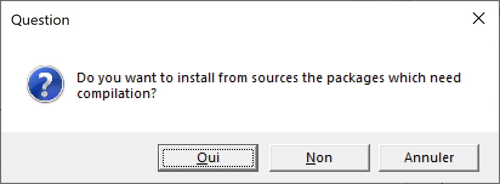

# Logiciels

## R

### Installation

R est inclus dans les distributions de Linux: le paquet est nommé `r-base`.
Il ne contient pas des outils de développement souvent nécessaires, donc il est préférable d'installer aussi le paquet `r-base-dev`.
La version de R est souvent un peu ancienne.
Pour disposer de la dernière version, il faut utiliser un mirroir de CRAN comme source des paquets : voir la documentation complète pour Ubuntu [^102].

[^102]: https://doc.ubuntu-fr.org/r 

Sous Windows ou Mac, installer R après l'avoir téléchargé depuis CRAN [^101].

[^101]: https://cran.r-project.org/

Sous Windows, l'installation doit être complétée par les "Rtools", qui contiennent les outils de développement dont ceux nécessaires à la compilation des packages contenant du code C++.

Sur Mac, l'installation de R est suffisante à partir de la version 4.0.0.


### Mise à jour

Il est conseillé d'utiliser la dernière version mineure de R: 4.0.x jusqu'à la sortie de la version 4.1.
Il est obligatoire d'utiliser la toute dernière version pour préparer un package soumis à CRAN.

Des changements importants ont lieu entre les versions majeures (la version 4 ne permet pas d'utiliser un package compilé pour la version 3) mais aussi parfois entre versions mineures (un fichier de données binaires `.rda` enregistré sous la version 3.3 ne peut pas être lu par la version 3.6).
Il est donc utile de mettre R à jour régulièrement.

L'installation d'une nouvelle version ne désinstalle par automatiquement les versions anciennes, ce qui permet d'en utiliser plusieurs en cas de besoin (par exemple, si un package ancien et indispensable n'est plus disponible).
En usage courant, il est préférable de désinstaller manuellement les anciennes versions après l'installation d'une nouvelle.


### Librairies {#sec:librairies}

Les packages de R se trouvent dans deux dossiers:

* la bibliothèque système (*System Library*) contient les packages fournis avec R : **base**, **utils**, **graphics** par exemple.
Elle se trouve dans un sous-répertoire du programme d'installation (`C:\Program Files\R\R-4.0.0\library` pour R version 4.0.0 sous Windows 10).
* La bibliothèque utilisateur (*User Library*) contient ceux installés par l'utilisateur.
Elle se trouve dans le dossier personnel de l'utilisateur, dans un sous-dossier `R\win-library\4.0\`).

Si le dossier personnel de l'utilisateur est sauvegardé (par exemple, s'il est répliqué dans le cloud par OneDrive sous Windows), il n'est pas optimal d'y placer les packages.
Pour que les packages soient installés automatiquement dans la bibliothèque système, il suffit que l'utilisateur y ait le droit d'écrire.
Sous Windows, donner le droit "Modifier" au groupe des utilisateurs de l'ordinateur sur le dossier de la biliothèque, en plus du droit de lecture par défaut \@ref(fig:R-library)).

(ref:R-library) Activation du droit de modifier la bibliothèque système sous Windows.
```{r R-library, fig.cap="(ref:R-library)", echo=FALSE}
knitr::include_graphics('images/R-library.png')
```

Si la bibliothèque utilisateur est retenue, il faut penser à vider le dossier correspondant à l'ancienne version de R en cas changement de version mineure.

L'emplacement des librairies est donné par la fonction `.libPaths()`:
```{r libPaths}
.libPaths()
```


## RStudio

RStudio est une interface graphique pour R et bien plus: il est conçu pour simplifier la gestion des projets, faciliter la rédaction et la production de documents et intégrer le contrôle de source par exemple.

### Installation

Installer la dernière version de *RStudio Desktop* à partir du site de RStudio [^103].

[^103]: https://rstudio.com/products/rstudio/download/

Une commande est disponible dans le menu *Help* de RStudio pour vérifier l'existence d'une version plus récente, à installer.

### Dossier de travail

Le dossier de travail par défaut est le dossier personnel de l'utilisateur, appelé `~` par RStudio:

```{r R_USER}
Sys.getenv("R_USER")
```

- `Mes Documents` sous Windows;
- `Home` sous Mac ou Linux.

Il faut systématiquement travailler dans des sous-dossier de `~`, par exemple : `~\Formation`. 

Pour le bon fonctionnement des *RTools*, le nom complet du répertoire de travail ne doit pas contenir d'espace (utiliser les tirets bas `_`) ni de caractère spécial.
Le dossier de travail en cours est obtenu par la commande `getwd()`.

```{r getwd}
getwd()
```

L'utilisation du contrôle de source (voir chapitre \@ref(chap:git)) crée de nombreux fichiers de travail.
Les projets sous contôle de source ne devraient pas se trouver dans un dossier déjà sauvegardé par un autre moyen, comme un lecteur OneDrive sous Windows, sous peine d'une utilisation excessive des ressources: chaque validation de modifications engendre la sauvegarde des fichiers modifiés, mais aussi des fichiers de contrôle qui peuvent être de grande taille.


### Solution retenue

L'organisation de l'environnement travail est une affaire personnelle, qui dépend des préférences de chacun.
L'organisation proposée ici n'est qu'une possibilité, à adapter à ses propres choix, mais en respectant les contraintes mentionnées.

Sous Windows, une organisation optimale est la suivante:

* Dans son dossier personnel (`Mes Documents`, `~` pour R), un dossier `R` est utilisé pour les projets simples, sans contrôle de source.
La sauvegarde de ce dossier est gérée par ailleurs.
* Un dossier hors du dossier personnel est utilisé pour les projets sous contrôle de source. 
L'utilisateur doit y avoir le droit d'écrire.
Dans l'organisation de Windows, le dossier correspondant à ces critères est `%LOCALAPPDATA%`, typiquement `C:\Users\NomUtilisateur\AppData\Local`.
Le dossier sera donc `%LOCALAPPDATA%\ProjetsR` à créer: exécuter `md %LOCALAPPDATA%\ProjetsR` dans une invite de commande.
Epingler ce dossier à l'accès rapide de l'explorateur de fichiers (figure  \@ref(fig:R-ProjetsR)): coller `%LOCALAPPDATA%\ProjetsR` dans la barre d'adresse de l'explorateur de fichiers, valider, puis faire un clic droit sur "Accès Rapide" et épingler le dossier.

(ref:R-ProjetsR) Dossier pour les projets sous contrôle de source, sous Windows.
```{r R-ProjetsR, fig.cap="(ref:R-ProjetsR)", echo=FALSE, out.width='100%'}
knitr::include_graphics('images/R-ProjetsR.png')
```


## Packages

### Installation depuis CRAN

L'installation classique des packages fait appel à CRAN.
Un bouton *Install* se trouve dans la fenête *Packages* de RStudio.

Les packages sont déposés sur CRAN par leurs auteur sous forme de code source, compressé dans une fichier `.tar.gz`. 
Ils sont disponibles pour le téléchargement dès leur validation.
Ils doivent ensuite être mis au format binaire pour Windows (dans un fichier `.zip`), ce qui prend un peu de temps.

A la demande de l'installation d'un package sous Windows, CRAN propose la version source plutôt que la version binaire si elle est plus récente \@ref(fig:R-BinaryPkg)).

(ref:R-BinaryPkg) Choix de la version des packages à installer.
```{r R-BinaryPkg, fig.cap="(ref:R-library)", echo=FALSE}

```

La liste des packages concernés est affichée dans la console, par exemple:
```
  There are binary versions available but the source 
  versions are later:
              binary   source needs_compilation
boot          1.3-24   1.3-25             FALSE
class         7.3-16   7.3-17              TRUE
```
Certains packages nécessitent une compilation (colonne `needs_compilation`), en général parce qu'ils contiennent du code C++.
Ils ne pourront être installés que par les *Rtools*. 

L'installation des packages en version source est beaucoup plus longue qu'en version binaire.
Sauf si une version précise d'un package est nécessaire, il est donc préférable de refuser l'installation des versions source.

Les packages peuvent être mis à jour un peu plus tard, après leur compilation par CRAN.

Le bouton *Update* dans la fenête *Packages* de RStudio permet de mettre à jour tous les packages installés.


### Installation depuis GitHub

Certains packages ne sont pas disponibles sur CRAN mais seulement sur GitHub parce qu'ils sont encore en développement ou parce qu'ils ne sont pas destinés à un large usage par la communauté des utilisateurs de R.
Il peut aussi être utile d'installer une version de développement d'un package publié sur CRAN pour un usage ponctuel comme le test de nouvelles fonctionnalités.

L'installation est gérée par le package **remotes**.
L'argument `build_vignettes` est nécessaire pour créer les vignettes du package.

```{r install_github, eval=FALSE}
remotes::install_github("EcoFoG/EcoFoG", build_vignettes = TRUE)
```

Le nom du package est entré sous la forme "UtilisateurGitHub/NomduPackage".
L'installation est faite à partir du code source et nécessite donc les *Rtools* si une compilation est nécessaire.
`install_github()` vérifie que la version sur GitHub est plus récente que l'éventuelle version installée sur le poste de travail et ne fait rien si elles sont identiques.


### Installation depuis Bioconductor

Bioconductor est une plateforme complémentaire de CRAN qui héberge des packages spécialisés dans la génomique.
L'installaton des packages de Bioconductor nécessite le package **BiocManager** pour sa fonction `install()`.
Le premier argument de la fonction est un vecteur de caractères contenant les noms des packages à installer, par exemple:

```{r Bioconductor, eval=FALSE}
BiocManager::install(c("GenomicFeatures", "AnnotationDbi"))
```

La fonction `install()` appelée sans arguments met à jour les packages.


### Solution retenue

A chaque mise à jour mineure de R, tous les packages doivent être réinstallés.
La façon la plus efficace de le faire est de créer un script `Packages.R` à placer dans `~\R`.
Il contient une fonction qui vérifie si chaque package est déjà installé pour ne pas le refaire inutilement.

```{r, eval=FALSE, tidy=FALSE}
# Installation des packages de R ####

# Installer les packages si nécessaire ####
InstallPackages <- function(Packages) {
  sapply(Packages, function(Package) 
    if (!Package %in% installed.packages()[, 1]) 
      {install.packages(Package)})
}


# Outils de développement ####
InstallPackages(c(
  # Outils de développement. Importe remotes, etc.
  "devtools",
  # Exécution de Check par RStudio
  "rcmdcheck",
  # Fomatage du code R (utilisé par knitr)
  "formatR",
  # Documentation des packages dans /docs sur GitHub
  "pkgdown",
  # Biliographie avec roxygen
  "Rdpack",
  # Mesure des performances
  "rbenchmark",
  # Documentation automatique des packages
  "roxygen2",
  # Tests des packages
  "testthat"
  ))

# Markdown ####
InstallPackages(c(
  # Tricot
  "knitr",
  # Documents markdown complexes
  "bookdown",
  # Sites web
  "blogdown",
  # Modèle de présentation
  "xaringan",
  # Modèles d'articles
  "rticles"     
  ))


# Tidyverse ####
InstallPackages("tidyverse")


# Mes packages ####

# EcoFoG
remotes::install_github("EcoFoG/EcoFoG", 
                        build_vignettes = TRUE)
```

La dernière partie du script est à compléter avec les packages utilisés régulièrement.

Ce script est à exécuter à chaque mise à jour de R, après avoir éventuellement activé le droit d'écriture dans la librairie système (voir section \@ref(sec:librairies)).


## Git

git est le logiciel de contrôle de source utilisé ici.
Son utilisation est détaillée dans le chapitre \@ref(chap:git).

Pour Windows et Mac, l'installation a lieu à partir du site [^104].

[^104]: https://git-scm.com/

git est intégré dans les distributions Linux.
Pour Ubuntu, le package apt est `git-all`.

git est installé sans interface graphique, fournie par RStudio.


## GitHub

*GitHub* est la plateforme accessible par un [site web](https://github.com/) qui permet de partager le contenu des dépôts *git*.
Pour l'utiliser, il suffit d'ouvrir un compte.


## MiKTeX

Pour produire des documents au format PDF, une distribution Latex est nécessaire.
La solution légère consiste à installer le package **tinytex**: sa fonction `install_tinytex()` installe une distribution Latex optimisée pour Rmarkdown.

Une distribution complète est préférée ici parce qu'elle permet l'utilisation de Latex au-delà de RStudio.
MiKTeX [^105] est une très bonne solution pour Windows et Mac.

[^105]: https://miktex.org/download


### Installation

Télécharger le fichier d'installation et l'exécuter.
Plusieurs choix sont à faire pendant l'installation:

* Installer le programme pour tous les utilisateurs (avec des droits d'administrateur);
* Le format par défaut du papier: choisir A4;
* Le mode d'installation des packages manquants: choisir "Always Install" pour qu'ils soient téléchargés automatiquement en cas de besoin.

Pour Linux, suivre les instructions sur le site de MiKTeX.


### Mises à jour

MiKTeX est installé avec les packages LaTeX les plus utilisés.
Si un document nécessite un package manquant, il est chargé automatiquement.
Les mises à jour de packages doivent être faites périodiquement avec la console MiKTeX, accessible dans le menu Démarrer.

Quand elle est lancée sans élévation des privilèges, la console propose de passer en mode administrateur.
Cliquer sur "Switch to Administrator mode".

Dans les paramètres (*Settings*), vérifier que les packages s'installent toujours automatiquement et que le format du papier est bien A4.

Dans le menu des mises à jour (*Updates*), cliquer sur "Check for updates" puis "Update now".    

Si l'installation automatique est défaillante, il est possible d'installer manuellement un package dans le menu "Packages".


## Go

Go [^105] n'est utilisé que par le générateur de sites web Hugo (voir section \@ref(sec:blogdown)).

Télécharger le fichier d'installation et l'exécuter.
A la fin de l'installation, exécuter la commande `go version` dans un terminal pour vérifier son bon fonctionnement.

Les mises à jour se font en installant la nouvelle version par dessus la précédente.
