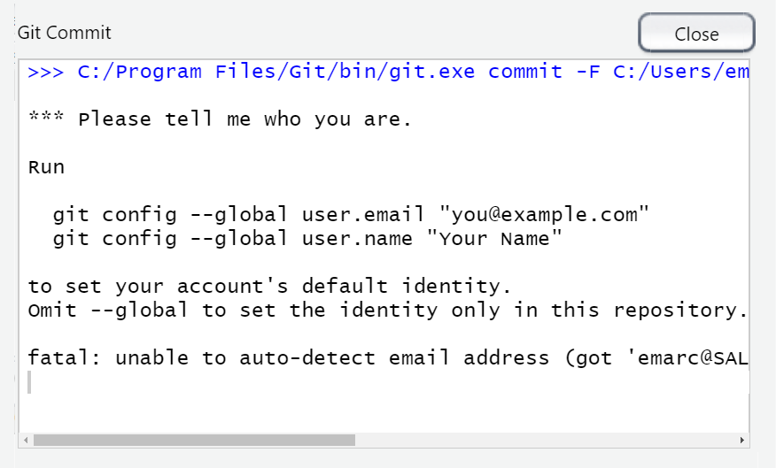
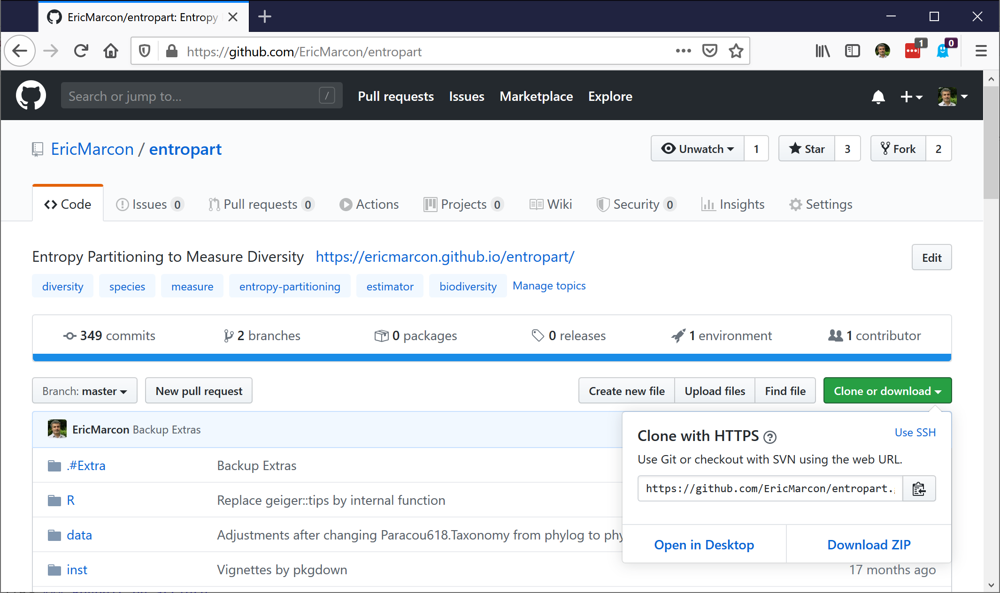

# Git et GitHub {#chap:git}

## Principes

### Contrôle de source

Le contrôle de source consiste à enregistrer l'ensemble des modifications apportées sur les fichiers suivis.
L'outil standard est aujourd'hui *git*.

Les commandes de *git* peuvent être exécutées dans le terminal de RStudio.

(ref:git-Status) Capture d'écran du terminal de RStudio. La commande `git status` supposée décrire l'état du dépôt renvoie une erreur si le projet R n'est pas sous contrôle de source.
```{r git-Status, fig.cap="(ref:git-Status)", echo=FALSE}
knitr::include_graphics('images/git-Status.png')
```

La commande `git status` (figure \@ref(fig:git-Status)) retourne l'état du dépôt (*repository*), c'est-à-dire l'ensemble des données gérées par *git* pour suivre le projet en cours.

RStudio intègre une interface graphique pour *git* suffisante pour se passer de la ligne de commande dans le cadre d'une utilisation standard, présentée ici.

### git et GitHub

*git* est le logiciel installé sur le poste de travail.

*GitHub* est une plateforme, accessible par un [site web](https://github.com/), qui permet de partager le contenu des dépôts *git* (pour travailler à plusieurs) et de partager de la documentation sous la forme d'un site web (*GitHub Pages*).

Comme *GitHub* permet au minimum la sauvegarde des dépôts *git*, les deux sont toujours utilisés ensemble.
*GitHub* n'est pas la seule plateforme utilisable mais la principale. Les alternatives sont [Bitbucket](https://bitbucket.org/) et [GitLab](https://about.gitlab.com/) par exemple.


## Créer un nouveau dépôt

### A partir d'un projet existant

Dans un projet R existant, activer le contrôle de source dans les options du projet (figure \@ref(fig:git-Project)).
La commande exécutée est `git init`.
Redémarrer RStudio à la demande.

(ref:git-Project) Activation du contrôle de source dans le menu *Tools/Project Options...*.
```{r git-Project, fig.cap="(ref:git-Project)", echo=FALSE}
knitr::include_graphics('images/git-Project.png')
```

Une nouvelle fenêtre *git* apparaît dans le panneau supérieur droit.
Elle contient la liste des fichiers du projet (figure \@ref(fig:git-Fichiers)).

(ref:git-Fichiers) Fichiers du projet, pas encore pris en compte par *git*.
```{r git-Fichiers, fig.cap="(ref:git-Fichiers)", echo=FALSE}
knitr::include_graphics('images/git-Fichiers.png')
```

A ce stade, les fichiers ne sont pas pris en compte par *git*: leur statut est un double point d'interrogation jaune.
Pour *git*, le répertoire de travail local est un *bac à sable* où toutes les modifications sont possibles sans conséquences.

Le fichier `.gitignore` contient la liste des fichiers qui n'ont jamais vocation à être pris en compte, qu'il est donc inutile d'afficher dans la liste: les fichiers intermédiaires produits automatiquement par exemple.
La syntaxe des fichiers `.gitignore` est détaillée dans la documentation de *git*[^1].
En règle générale, utiliser un fichier existant: les modèles de documents notamment incluent leur fichier `.gitignore`.

[^1]: https://git-scm.com/docs/gitignore


### Prendre en compte des fichiers

Dans la fenêtre *Git*, cocher la case "Staged" permet de prendre en compte (*Stage*) chaque fichier. 
La commande exécutée est `git add <NomDeFichier>`.
Les fichiers pris en compte une première fois ont le statut "A" pour "Added".

Les fichiers pris en compte font partie de l'*index* de *git*.


### Valider des modifications

(ref:git-Commit) Fenêtre de validation des modifications prises en compte.
```{r git-Commit, fig.cap="(ref:git-Commit)", echo=FALSE}
knitr::include_graphics('images/git-Commit.png')
```

Les fichiers pris en compte peuvent être validés (*Commit*) en cliquant sur le bouton *Commit* dans la fenêtre *Git*.
Une nouvelle fenêtre s'ouvre (figure \@ref(fig:git-Commit)), qui permet de visualiser toutes les modifications par fichier (ajouts en verts, suppressions en rouge).
Le grain de modification traité par *git* est la ligne de texte, terminée par un retour à la ligne.
Les fichiers binaires comme les images sont traités en bloc.

Chaque validation (*Commit*) est accompagnée d'un texte de description.
La première ligne est la description courte.
Une description détaillée peut être ajoutée après un saut de ligne.
Pour la lisibilité de l'historique du projet, chaque *Commit* correspond donc à une action, correspondant à la description courte: tous les fichiers modifiés ne sont pas forcément pris en compte et validés en une fois.
La commande exécutée est `git commit -m "Message de validation"`.

(ref:git-id) Fenêtre de demande d'indentification.
```{r git-id, fig.cap="(ref:git-id)", echo=FALSE}

```

Les validations sont liées à leur auteur, qui doit être identifié par git.
En règle générale, git utilise les informations du système.
S'il n'y parvient pas, une fenêtre demande à l'utilisateur de s'identifier avant d'effectuer son premier *Commit* (figure \@ref(fig:git-id)).
Les commandes indiquées sont à exécuter dans le terminal de RStudio.
Elles peuvent aussi être utilisées pour vérifier les valeurs connues par git:
```
git config user.name
git config user.email
```

Dès la première validation, la branche principale du dépôt, appelée "master", est créée.
Une branche est une version du dépôt, avec son propre historique et donc ses propres fichiers.
Les branches permettent:
* de développer de nouvelles fonctionnalités dans un projet, sans perturber la branche principale qui peut contenir une version stable. Si le développement est retenu, sa branche pourra être fusionnée avec la branche *master* pour constituer une nouvelle version stable.
* de contenir des fichiers totalement différents de ceux de la branche principale, pour d'autres objectifs. Sur GitHub, les pages web de présentation du projet peuvent être placés dans une branche appelée "gh-pages" qui ne sera jamais fusionnée.

Le dépôt *git* est complètement constitué.
Dans le vocabulaire de *git*, il comprend trois *arbres* (figure \@ref(fig:git-Trees)):

* le répertoire de travail, ou bac à sable, qui contient les fichiers non pris en compte: inconnus, modifiés, supprimés ou renommés (case *Staged* décochée);
* l'index, qui contient les fichiers pris en compte (case *Staged* cochée);
* la tête, qui contient les fichiers validés.

(ref:git-Trees) Les trois arbres de *git*. Source: https://rogerdudler.github.io/git-guide/index.fr.html
```{r git-Trees, fig.cap="(ref:git-Trees)", echo=FALSE}
knitr::include_graphics('images/git-Trees.png')
```

Le statut des fichiers est représenté par deux icônes dans la fenêtre *Git* de RStudio: deux points d'interrogation quand ils n'ont pas été pris en compte par *git*. 
Ensuite, l'icône de droite décrit la différence entre le le répertoire de travail et l'index.
Celle de gauche décrit la différence entre l'index et la tête.
Un fichier modifié aura donc l'icône `M` affichée à droite avant d'être pris en compte, puis à gauche après prise en compte.
Il est possible, même s'il vaut mieux l'éviter,  de modifier à nouveau un fichier pris en compte avant qu'il soit validé: alors, les deux icônes seront affichées.


### Créer un dépôt vide sur GitHub

(ref:CreateRepo) Création d'un dépôt sur*GitHub*.
```{r CreateRepo, fig.cap="(ref:CreateRepo)", echo=FALSE}
knitr::include_graphics('images/CreateRepo.png')
```

Un dépôt vide sur *GitHub* doit être créé (figure \@ref(fig:CreateRepo)):

* Sur *GitHub*, cliquer sur le bouton vert “New repository”.
* Saisir le nom du dépôt, identique à celui du projet R local.
* Ajouter une description, qui apparaîtra uniquement sur la page GitHub du dépôt.
* Choisir le statut du dépôt:
  * Public: visible par tout le monde
  * Privé: visible seulement par les collaborateurs du projet, ce qui exclut de compléter par des pages web de présentation.
* Ne pas ajouter de `README`, `.gitIgnore` ou licence: le projet doit être vide.
* Cliquer sur "create Repository".
* Copier l'adresse du dépôt (https://github.com/...)


### Lier git et GitHub

Dans RStudio, cliquer sur le bouton violet en haut à droite de la fenêtre *Git* (figure \@ref(fig:git-Fichiers)).
Saisir le nom de la branche "master".
Cocher la case "Sync with Remote".
Cliquer sur "Add Remotes" et compléter:

* Remote Name: `origin`
* Remote URL: coller l'adresse du dépôt *GitHub*.

Au message indiquant qu'une branche *master* existe déjà, cliquer sur "Overwrite".

Le nom *origin* est une convention de *git*.
Il peut être modifié mais l'organisation du projet sera plus lisible en respectant la convention.


A la première connexion de RStudio à GitHub, une fenêtre d'authentification permet de saisir ses identifiants GitHub (figure \@ref(fig:git-PAT)).

(ref:git-PAT) Création d'un dépôt sur*GitHub*.
```{r git-PAT, fig.cap="(ref:git-PAT)", echo=FALSE}
knitr::include_graphics('images/git-PAT.png')
```

GitHub délivre un jeton d'accès personnel (PAT) à git (voir section \@ref(sec:pat) pour plus de détails) pour éviter de répéter la saisie des informations d'authentification à chaque opération.
Un message électronique est envoyé au titulaire du compte GitHub pour l'en avertir.


### Pousser les premières modifications

La manipulation précédente a automatiquement poussé (*Push*) les modifications validées sur GitHub.
Par la suite, il faudra cliquer sur le bouton "Push" de la fenêtre *Git* pour le faire.

Sur *GitHub*, les fichiers résultant des modifications enregistrées par *git* sont maintenant visibles.

Chaque *Commit* réalisé localement est compté par *git* et un message "Your branch is ahead of 'origin/master' by *n* commits" affiché dans en haut de la fenêtre *Git* indique qu'il est temps de mettre à jour *GitHub* en poussant l'ensemble de ces *Commit*.
Cliquer sur le bouton *Push* pour le faire.

```{exercise, git-README, name="Mettre à jour README"}
Si un fichier README.md existe dans le projet, le mettre à jour.
Sinon, créer un fichier un fichier texte et l\'enregister sous ce nom.

Le fichier README.md décrit le contenu du dépôt sur son site GitHub.
Il doit contenir au minimum le nom du projet, en titre de niveau 1, sur sa première ligne, suivi d'une ligne vide:
`# Ouvrage`

Attention à terminer tous les fichiers par une ligne vide.

Sauvegarder le fichier, le prendre en compte (*Stage*), le valider (*Commit*), pousser les modifications sur *GitHub* et vérifier sur *GitHub* que le fichier est bien mis à jour.
```


### Cloner un dépôt de GitHub

(ref:git-Clone) Clonage d'un dépôt à partir de *GitHub.*
```{r git-Clone, fig.cap="(ref:CreateRepo)", echo=FALSE}

```

Tout dépôt sur GitHub peut être installé (on dit *cloné*) sur le poste de travail en copiant son adresse qui apparaît en cliquant sur le bouton vert (figure \@ref(fig:git-Clone)).

Dans RStudio, créer un nouveau projet et, dans l'assistant, choisir "Version Control", "Git" et coller l'adresse dans le champ "Repository URL".
Le nom répertoire à créer pour le projet est déduit automatiquement de l'adresse.
Choisir le répertoire dans lequel celui du projet va être créé et cliquer sur "Create Project".
Le projet créé est lié au dépôt distant sur *GitHub*.

Pour travailler à plusieurs sur le même projet, le propriétaire du projet doit donner l'accès au projet à des collaborateurs (figure \@ref(fig:git-Access)), c'est-à-dire d'autres utilisateurs *GitHub* dans les réglages du dépôt (*Settings*).

(ref:git-Access) Clonage d'un dépôt à partir de *GitHub.*
```{r git-Access, fig.cap="(ref:CreateRepo)", echo=FALSE}
knitr::include_graphics('images/git-Access.png')
```

Les collaborateurs sont invités par un message envoyé par *GitHub*.


## Usage courant

### Tirer, modifier, valider, pousser

Toute séance de travail sur un projet commence en tirant (Bouton "Pull") de la fenêtre *Git* pour intégrer au dépôt local les mises à jour effectuées sur *GitHub* par d'autres collaborateurs.

Les modifications apportées aux fichiers du projet sont ensuite prises en compte (cocher les cases *Staged*) et validées (*Commit*) avec un message explicatif.
Une bonne pratique consiste à valider les modifications à chaque fois qu'une tâche élémentaire, qui peut être décrite dans le message explicatif, est terminée plutôt que d'effectuer des *Commits* regroupant de nombreux changements avec une description vague.

Dès que possible, pousser (*Push*) les mises à jour pour qu'elles soient visibles par les collaborateurs.


### Régler les conflits

Il n'est pas possible de pousser les modifications validées si un collaborateur a modifié le dépôt distant sur *GitHub*.
Il faut alors les tirer pour les intégrer au dépôt local avant de pousser les modifications fusionnées. 

Un conflit a lieu si un *Pull* importe dans le fichier local une modification qui ne peut pas être fusionnée automatiquement parce qu'une modification contradictoire a eu lieu localement. 
*Git* considère chaque ligne comme un élément indivisible: la modification de la même ligne sur le dépôt distant et le dépôt local génère donc un conflit.

*Git* insère dans le fichier contenant un conflit les deux versions avec une présentation particulière:

```
<<<<<<<<< HEAD # Version importée du conflit
Lignes en conflit, version importée
========= # limite entre les deux versions
Lignes en conflit, version locale
>>>>>>>>> # Fin du conflit
```

Les lignes de formatage contenant les `<<<<`, les `====` et les `>>>>` doivent être supprimés et une seule version des lignes problématiques conservée, qui peut être différente des deux versions originales.
La résolution du conflit doit être prise en compte et validée.

Pour limiter les conflits dans un document contenant du texte (typiquement, un document *Markdown*), une bonne pratique consiste à traiter chaque phrase comme une ligne, terminée par un retour à la ligne qui ne sera pas visible dans le document mis en forme: un saut de ligne est nécessaire pour séparer les paragraphes.


### Voir les différences

Dans la fenêtre *Git* de RStudio, le menu contextuel (affiché par un clic droit) "Diff" peut être utilisé pour afficher les modifications apportées à chaque fichier (figure \@ref(fig:git-diff)).

(ref:git-diff) Différences entre le répertoire de travail et la tête.
```{r git-diff, fig.cap="(ref:git-diff)", echo=FALSE}
knitr::include_graphics('images/git-diff.png')
```

### Revenir en arrière

Le menu contextuel "Revert" permet d'annuler toutes les modifications  apportées à un fichier (affichées par *Diff*) et de rétablir son contenu validé la dernière fois (son état dans la tête).

Il n'est pas simple de revenir en arrière au-delà de la dernière validation parce que les modifications ont pu être prises en compte par des collaborateurs: leur suppression rendrait le projet incohérent.


### Voir l'historique

Le bouton en forme d'horloge de la fenêtre *Git* de RStudio affiche l'historique du projet (figure \@ref(fig:git-historique)).

(ref:git-historique) Historique des validations dans le dépôt.
```{r git-historique, fig.cap="(ref:git-historique)", echo=FALSE}
knitr::include_graphics('images/git-historique.png')
```

En haut se trouve la tête, puis toutes les validations (*commits*) qui l'ont constituée.
Pour chaque validation, les différences de chaque fichier peuvent être affichées en cliquant sur le nom du fichier dans la partie basse de la fenêtre.


## Usage avancé

### Commandes de git

Au-delà de l'usage courant permis par l'interface graphique de RStudio, des manipulations avancées des projets sont permises en utilisant git en ligne de commande.
Quelques exemples utiles sont présentés ici.

Un petit guide des commmandes est proposé par Roger Dudler [^301].
Il résume les commandes essentielles, donc intégrées à l'interface graphique de RStudio.
Des liens vers des références plus complètes sont donnés en bas de la page.

[^301]: https://rogerdudler.github.io/git-guide/index.fr.html


### Taille d'un dépôt

Pour connaître l'espace disque occupé par un dépôt, utiliser la commande `git count-objects -vH` [^302].

[^302]: https://git-scm.com/docs/git-count-objects

Les données pour ce document au stade de la rédaction sont présentées à titre d'exemple.

```
$ git count-objects -v
count: 200
size: 2.66 MiB
in-pack: 0
packs: 0
size-pack: 0
prune-packable: 0
garbage: 0
size-garbage: 0
```

La taille totale est sur la ligne *size*.
Les packs sont une méthode utilisée par git pour réduire la taille du dépôt: des fichiers similaires sont stockés sous la forme d'une partie commune et de différences.
La ligne *prune-packable* donne la taille d'objets stockés à la fois sous forme individuelle et dans des packs.
Si leur taille est importante, exécuter `git prune-packed` pour la ramener à zéro.

La ligne *size-garbage* donne la taille des objets qui peuvent être supprimés.
`git gc` les supprime, mais pas seulement: il optimise le stockage.

```
$ git gc
Enumerating objects: 194, done.
Counting objects: 100% (194/194), done.
Delta compression using up to 8 threads
Compressing objects: 100% (188/188), done.
Writing objects: 100% (194/194), done.
Total 194 (delta 83), reused 0 (delta 0)

$ git count-objects -vH
count: 1
size: 5.72 KiB
in-pack: 194
packs: 1
size-pack: 4.00 MiB
prune-packable: 0
garbage: 0
size-garbage: 0 bytes
```

Ici, la majorité des objets du dépôt a été placée dans un pack (mais sa taille est supérieure à celle des objets individuels).

Il est généralement inutile d'effectuer la collecte des déchets manuellement: git gère bien l'organisation de ses dépôts.

GitHub limite la taille des dépôts.
En mai 2020, la limite est de 100 Go.
La taille de tous les dépôts d'un utilisateur authentifié peut être affichée dans les réglages de son compte ("Personnal Settings", "Repositories")[^303].

[^303]: https://github.com/settings/repositories


### Supprimer un dossier

Toutes les modifications apportées à un dépôt sont stockées dans son historique.
Il peut être utile d'en supprimer dans quelques cas particuliers:

- si un fichier contenant des informations confidentielles a été validé par mégarde. 
La validation de sa suppression ne le retire pas de l'historique, et les informations condidentielles restent visibles en consultant l'historique.
- si des fichiers volumineux ne sont plus nécessaires, par exemple des fichiers PDF produits par RMarkdown (chapitre \@ref(chap:rediger)), binaires (donc inadaptés à git) et reproductibles à partir du code.

Typiquement, le dossier `docs` est utilisé pour stocker les documents produits à partir de code RMarkdown.
Les fichiers HTML et PDF doivent s'y trouver pour constituer les pages GitHub du projet.
Chaque modification du dépôt génère une nouvelle version de ces fichiers dont le volume de l'historique devient rapidement considérable.
Une solution efficace consiste à déléguer la création de ces fichiers à un système d'intégration continue (chapitre \@ref(chap:ci)) et à retirer le dossier `docs` de la branche principale (*master*) du dépôt.
Il faut alors supprimer tout son historique pour récupérer la place qu'il occupe, qui peut être l'essentiel de la taille du dépôt.

Les commandes de suppression complète d'un dossier d'un dépôt son présentées ici [^304].
Le dépôt doit être propre, c'est-à-dire sans modifications non validées, et les versions distantes et locales synchronisées.

[^304]: https://stackoverflow.com/questions/10067848/remove-folder-and-its-contents-from-git-githubs-history

Les trois commandes suivantes suppriment complètement le dossier `docs` de l'historique du dépôt git:
```
git filter-branch --tree-filter "rm -rf docs" |>
    --prune-empty HEAD
git for-each-ref --format="%(refname)" refs/original/ |>
    | xargs -n 1 git update-ref -d
```

Le dossier n'est pas supprimé du répertoire de travail.
Il doit donc être ajouté au fichier `.gitignore` pour ne plus être suivi.
La modification de `.gitignore` doit être validée.
Ces opérations peuvent être réalisées avec l'interface de RStudio ou en ligne de commande:
```
echo docs/ >> .gitignore
git add .gitignore
git commit -m 'Removing docs folder from git history'
```

Le nettoyage du dépôt est nécessaire pour supprimer physiquement les données retirées:
```
git gc
```

Enfin, le dépôt doit être poussé.
L'option `--force` implique le remplacement du contenu du dépôt distant par celui du dépôt local: toutes les modifications faites par des collaborateurs sont effacées, c'est pourquoi cette opération de nettoyage implique l'arrêt complet du projet pendant qu'elle a lieu.
```
git push origin master --force
```

Ce code peut être utilisé pour supprimer totalement n'importe quel fichier ou dossier d'un dépôt en remplaçant simplement `docs` dans la commande `git filter-branch` initiale.
La réduction de la taille du dépôt peut être suivie en utilisant `git count-objects -vH` avant l'opération, avant `git gc` (la taille du dépôt reste stable mais a été déplacée vers *garbage*) et à la fin (la taille du dépôt est sensiblement réduite).
