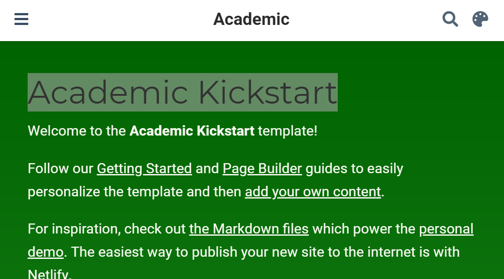

# Rédiger {#chap:rediger}

## Bloc-note Markdown (R Notebook)

Le code doit toujours être commenté pour faciliter sa lecture.
Quand l'explication du code nécessite plusieurs lignes de commentaire par ligne ou bloc de code, il est temps d'inverser la logique et de placer le code dans un texte.

L'outil le plus simple est le bloc-note Markdown (Menu "File/New File/R Notebook").
Le modèle de document contient son mode d'emploi.

Le langage qui permet de formater le texte est Markdown [^401], un langage de balisage simple à utiliser:

* Les paragraphes sont séparés par des sauts de ligne;
* Le document est structuré par des titres: leur ligne commence par un nombre de `#` correspondant à leur niveau;
* Les formats de caractères sont limités à l'essentiel: italique ou gras (texte entouré par une ou deux `*`);
* D'autres codes simples permettent tous les formatages utiles.

[^401]: https://fr.wikipedia.org/wiki/Markdown

Ce langage est le pivot du logiciel pandoc [^403], dédié à la conversion de documents de formats différents.

[^403]: https://fr.wikipedia.org/wiki/Pandoc

Le package **rmarkdown** [@Xie2015] fait le lien entre R et Markdown, en s'appuyant sur l'interface de RStudio qui n'est pas indispensable mais simplifie énormément son utilisation.
Le dialecte de Markdown utilisé par le package est appelé *R Markdown*.
Sa syntaxe est résumée dans une antisèche [^402].
Sa documentation complète est en ligne [@Xie2018].

[^402]: https://rstudio.com/wp-content/uploads/2015/02/rmarkdown-cheatsheet.pdf

L'organisation la plus simple d'un document *R Markdown* est visible dans le modèle de bloc-note.
Il commence par un en-tête au format YAML [^404]:

```
---
title: "R Notebook"
output: html_notebook
---
```

[^404]: https://fr.wikipedia.org/wiki/YAML

La première entrée est le titre, la seconde le format de sortie: plus précisément le nom de la fonction chargée de traiter le document.

Le document contient du texte formaté en Markkdown et des bouts de code (*code chunks*) entourés par trois accents graves (la syntaxe markdown d'un bloc de code) et une description du langage, ici `{r]`.
Ces bouts de code sont traités par **knitr** qui transforme le résultat de l'exécution du code R en Markdown et l'intègre au texte du document.

Traiter un document R Markdown s'appelle le *tricoter* (*knit*).
La chaîne de production est la suivante :

* **knitr** traite les bouts de code: calculs, production de figures; 
* **rmarkdown** intègre la production des bouts de code et texte pour produire un fichier Markdown standard;
* pandoc (installé avec RStudio) convertit ce fichier au format HTML, LaTeX ou Word;
* LaTeX produit un fichier PDF quand ce format est demandé.

RStudio permet de lancer le tricot par des boutons plutôt que par des commandes: dans la fenêtre source (celle du haut à gauche), un bouton "Knit" accompagne les documents R Markdown.
Pour les bloc-notes R Markdown, il est remplacé par un bouton "Preview" avec les mêmes fonctions.
Il peut être déroulé pour choisir le format de sortie: HTML, Word, PDF (en passant par LaTeX) et, pour les bloc-notes, une commande "Preview" qui affiche le document en HTML sans exécuter les bouts de code pour gagner du temps.
Dès le premier tricot au format Word ou HTML, on remarquera que le bouton "Preview" disparaît.

Au final, l'utilisation de R Markdown combine plusieurs avantages:

* La simplicité de la rédaction: le texte brut est plus facile à lire et à formater qu'en LaTeX par exemple;
* L'automatisation de la production: le formatage et la mise en page sont entièrement automatiques;
* La reproductibilité: chaque document peut être autosuffisant accompagné de ses données.
Relancer le tricotage régénère entièrement le document, y compris les calculs nécessaires et la production des figures.

Elle a aussi quelques inconvénients: 

* Le formatage dépend de modèles, et developper de nouveaux modèles n'est pas simple;
* Les erreurs de tricot sont parfois difficiles à corriger, notamment quand elles interviennent à l'étape de la compilation LaTeX;
* La reproductibilité consomme du temps de calcul.
Pour limiter ce problème, un système de cache permet de ne pas réévaluer tous les bouts de code R à chaque modification du texte. La production de gros documents peut aussi être déléguée à un système d'intégration continue (chapitre \@ref(chap:ci))


## Modèles R Markdown

Des modèles de document plus élaborés que le bloc-note sont fournis par des packages, dont **rmarkdown**.
Ils sont accessibles par le menu "File/New File/R Markdown..."  \@ref(fig:e-rmd1)).

(ref:e-rmd1) Nouveau document Markdown à partir d'un modèle.
```{r e-rmd1, fig.cap="(ref:e-rmd1)", echo=FALSE}
knitr::include_graphics('images/e-rmd1.png')
```

Les modèles les plus simples sont *Document* et *Presentation*.
Les informations à fournir sont le titre et le nom de l'auteur, et le format du document attendu (qui pourra être modifié plus tard).
Ces modèles créent un seul fichier dont l'enregistrement ne sera obligatoire qu'au moment de tricoter.

La syntaxe est la même que celle du bloc-note.
Dans l'entête, une entrée supplémentaire est utilisée pour la date, qui peut être calculée par R à chaque tricot:

```
date: "`r Sys.Date()`"
```

Le code R en ligne (par opposition aux bouts de code) peut être utilisé partout dans un document R Markdown.
Il commence par un guillemet inversé suivi de `r `et se termine par un autre guillement inversé.

Les documents peuvent être tricotés au format HTML, PDF (via LaTeX) ou Word.
L'entête du fichier R Markdown est réécrit quand le tricot est lancé par le bouton de RStudio qui place en premier le format de sortie utilisé et l'ajoute si nécessaire.

Les présentations peuvent être tricotées dans deux formats HTML, ioslide [^407] ou Slidy [^408], au format Beamer (PDF) [^409] ou en Powerpoint [^410].

[^407]: https://bookdown.org/yihui/rmarkdown/ioslides-presentation.html

[^408]: https://bookdown.org/yihui/rmarkdown/slidy-presentation.html

[^409]: https://bookdown.org/yihui/rmarkdown/beamer-presentation.html

[^410]: https://bookdown.org/yihui/rmarkdown/powerpoint-presentation.html

Le niveau 2 de plan (`##`) marque le changement de diapositive.

Du code supplémentaire, présenté dans les documentations des formats HTML, permet d'utiliser des fonctionnalités spécifiques.

Ces modèles sont simples mais assez peu utiles: le bloc-note R est plus facile à utiliser que le modèle de document pour des documents très simples.
Des modèles plus élaborés sont disponibles.


## Memo, article : bookdown

RMarkdown ne permet pas de rédiger un article scientifique.
La bibliographie ne pose pas de problème parce qu'elle est gérée par pandoc pour les documents HTML ou Word et sous-traitée à LaTeX pour les documents PDF. 
Les équations, figures et tableaux sont numérotés par LaTeX mais pas en HTML. 
Les références croisées (les renvois à un numéro de figure par exemple) ne sont pas supportés.
Enfin, les légendes de figures ou tableaux ne supportent que du texte brut, sans aucun formatage.

**bookdown** comble ces manques.
Le package a été conçu pour la rédaction d'ouvrages comportant plusieurs chapitres mais peut être utilisé pour des articles.
Le package ne fournit pas directement de modèles.

Le package **EcoFoG** disponible sur GitHub fournit les modèles présentés ici.
Il doit être installé:
```{r, eval=FALSE}
remotes::install_github("EcoFoG/EcoFoG")
```


### Modèle memo

Le modèle mémo produit un document HTML simple avec une table des matières flottante ([exemple](https://ericmarcon.github.io/Krigeage/Krigeage.html)).
Le format PDF est proche du modèle *article* de LaTeX ([exemple](https://ericmarcon.github.io/Krigeage/Krigeage.pdf)).

Le modèle contient sa propre documentation.

#### Créer

#### Ecrire

#### Tricoter

#### Mettre en ligne

GitHub Pages, production locale

### Autres modèles

rticles,...

## Ouvrage : bookdown

Document long. 
Le compilateur Latex change.

#### Créer

#### Ecrire

#### Tricoter

#### Intégration continue


## Site web : blogdown {#sec:blogdown}

Pour créer une page web personnelle, *Hugo* est un générateur de site statique capable de produire des pages HTML à partir de code Markdown.
Les sites statiques ont l'avantage, en comparaison aux sites dynamiques gérés par un système de gestion de contenu (CMS, par exemple: Wordpress, Joomla, SPIP), d'être portables sur n'importe quel serveur web sans support de base de données ni de code à exécuter côté le serveur (comme PHP) et d'être très rapides puisque les pages sont créées une seule fois et non à chaque consultation.
Un site Hugo peut être hébergé par exemple sur la page personnelle de tout utilisateur de GitHub.

Hugo propose de nombreux thèmes, qui sont des modèles de structure de sites, donc le thème **Academic**, prévu pour des chercheurs.
Dans RStudio, le package **blogdown** est prévu pour produire facilement des pages web avec Hugo.
Nous utiliserons donc cette solution, pour un site comme celui proposé en exemple [^411].

[^411]: https://ericmarcon.github.io/


#### Installation des outils

La première étape consiste à installer le package **blogdown** dans R.

```{r blogdown, eval=FALSE}
install.packages('blogdown') 
```

**blogdown** est capable d'installer Hugo sous Windows, macOS ou Linux.
```{r Hugo, eval=FALSE}
blogdown::install_hugo()
```

Par la suite, la mise à jour de Hugo pourra être faite par:
```{r mqjHugo, eval=FALSE}
blogdown::update_hugo()
```
La documentation complète de **blogdown** est disponible [^412].

[^412]: https://bookdown.org/yihui/blogdown/

Les versions récentes de Hugo utilisent Go (le langage de programmation) pour installer leur modules à la volée: ici le thème Academic est chargé depuis GitHub au moment de la création du site.
Go doit donc être installé [^414].

[^414]: https://golang.org/doc/install


#### Créer

La façon la plus simple consiste à créer un dépôt sur GitHub à partir du modèle.
Sur la page du dépôt *starter-academic* [^413], cliquer sur le bouton "Use this template", s'authentifier éventuellement sur GitHub, puis saisir le nom du dépôt qui contiendra le projet, par exemple "MySite".
Créer le dépôt.
Copier l'adresse du dépôt en cliquant sur le bouton "Code" puis sur le bouton à droite de l'adresse (figure \@ref(fig:rediger-GitHub-Clone)).

(ref:rediger-GitHub-Clone) Copie de l'adresse d'un dépôt à cloner sur GitHub.
```{r rediger-GitHub-Clone, fig.cap="(ref:rediger-GitHub-Clone)", echo=FALSE}
knitr::include_graphics('images/rediger-GitHub-Clone.png')
```

[^413]: https://github.com/wowchemy/starter-academic

Dans RStudio, créer un nouveau projet à partir de GitHub: dans le menu des projets en haut à droite, cliquer sur *New Project...* puis *Version Control* puis *Git* puis coller l'adresse dans le champ "Repositry URL" (figure \@ref(fig:rediger-Projet-GitHub)).
Sélectionner le dossier dans lequel le projet sera créé en cliquant sur "Browse" et enfin cliquer sur "Create Project".

(ref:rediger-Projet-GitHub) Copie de l'adresse d'un dépôt à cloner sur GitHub.
```{r rediger-rediger-Projet-GitHub, fig.cap="(ref:rediger-rediger-Projet-GitHub)", echo=FALSE}
knitr::include_graphics('images/rediger-Projet-GitHub')
```

Le projet créé est une copie exacte du modèle, qui doit être personnalisée.

RStudio ajoute automatiquement à la fin du fichier `.gitignore` une ligne pour ignorer ses fichiers de travail (dossier `.Rproj.user`).
Ajouter une ligne de commentaire pour le signaler.
Le contenu de `.gitignore` doit être le suivant:

```
# IDEs
.idea/

# Hugo
/resources/
public/

# R
.Rproj.user
.RData
.Rhistory
```

Un bug de **blogdown** nécessite de déplacer le fichier `config/_default/config.toml` à la racine du projet.

Prendre en compte ces modification dans git en faisant un commit.

Exécuter 
```{r}
blogdown:::serve_site()
```

pour construire le site web.
Il apparaît dans la fenêtre Viewer de RStudio, dont le bouton d'agrandissement permet l'affichage dans le navigateur internet par défaut du système.

Pour modifier le contenu du site, il est préférable d'arrêter le serveur web par la commande:
```{r}
blogdown:::stop_server()
```

Si le site est multilingue (Français et Anglais par exemple), son contenu  (dossier `content`) doit être copié dans un dossier correspondant à chaque langue. Par exemple, le fichier `content/authors/admin/_index.md` qui contient les informations sur le propriétaire du site est dupliqué dans `content/en/authors/admin/_index.md` et `content/fr/authors/admin/_index.md` si le site supporte l'Anglais et le Français.


#### Ecrire

Utiliser la documentation en ligne [^415].
L'exemple utilisé ici est le site personnel de l'auteur [^416].

[^415]: https://wowchemy.com/docs/page-builder/

[^415]: https://ericmarcon.github.io/

La méthode de travail consiste à progresser pas à pas en testant puis validant chaque étape:

* Effectuer les modifications;
* Construire le site et vérifier le résultat: `blogdown:::serve_site()`;
* Arrêter le site: `blogdown::stop_server()`;
* Si le résultat n'est pas satisfaisant, recommencer;
* Valider les modifications (*commit*).


##### Page d'accueil

La page d'accueil du site est constituée par une suite d'éléments (*widgets*) qui se trouvent dans `/contents/<langue>/home`.
Chaque élément est décrit par un fichier markdown.
Le premier est `index.md`.
Il n'est normalement jamais modifié.
Son contenu est le suivant:
```
+++
# Homepage
type = "widget_page"
headless = true  # Homepage is headless, other widget pages are not.
+++
```

Le fichier ne contient qu'un entête au format TOML, encadré par une ligne de `+++`.
Le type de composant (`type`) indique qu'il s'agit d'une page de composants, dans laquelle les autres composants du dossier trouveront leur place.
`headless = true` signifie que la page n'a pas d'entête.

(ref:rediger-demo) Composant `demo` dans Academic.
```{r rediger-demo, fig.cap="(ref:rediger-demo)", echo=FALSE}

```

Le composant `demo.md` (figure \@ref(fig:rediger-demo)) est un composant de type "blank", c'est-à-dire une page de texte libre: il sert ici à présenter le modèle Academic Kickstart et doit donc être désactivé.
L'entête contient ses informations de formatage (titre, nombre de colonnes, couleurs...) et le contenu de la page est écrit en markdown.
Les composants apparaissent par ordre croissant de poids (`weight` dans l'entête): 15 marque le premier composant dans le modèle Academic.
Le composant peut être désactivé en supprimant son fichier ou en modifiant sa propriété `active` dans l'entête:
```
active = false  # Activate this widget? true/false
```

(ref:rediger-about) Composant `about` dans Academic.
```{r rediger-about, fig.cap="(ref:rediger-about)", echo=FALSE}
knitr::include_graphics('images/rediger-about.png')
```

Le composant suivant est `about.md` (figure \@ref(fig:rediger-about)).
Il présente le propriétaire du site.
Son titre doit être localisé.
Dans le dossier `/content/fr/home`, sa valeur sera:
```
title = "Biographie"
```

L'auteur (`author`) doir correspondre à un dossier de `/contents/<langue>/authors`.
`admin` convient parfaitement pour un site personnel.
Academic permet de créer des sites d'équipes: dans cette configuration, un dossier par personne serait nécessaire.
L'image affichée par le composant est le fichier `avatar.jpg` placé dans ce dossier.
Limiter la taille du fichier pour la performance du site (moins d'un mégaoctet est une taille raisonnable), tout en assurant une taille minimale de quelques centaines de pixels de côté pour la qualité de l'affichage.

Le contenu du composant est lu dans le fichier `_index.md` du même dossier.
Son organisation est assez claire: modifier son contenu à partir de l'exemple fourni.

(ref:rediger-skills) Composant `skills` dans Academic.
```{r rediger-skills, fig.cap="(ref:rediger-skills)", echo=FALSE}
knitr::include_graphics('images/rediger-skills.png')
```

Le composant talents (`skills`, figure \@ref(fig:rediger-skills)) présente les compétences de l'auteur de façon graphique.
Une collection d'icônes est disponible, et des icônes nouvelles peuvent être ajoutées.

(ref:rediger-experience) Composant `experience` dans Academic.
```{r rediger-experience, fig.cap="(ref:rediger-experience)", echo=FALSE}
knitr::include_graphics('images/rediger-experience.png')
```

Le composant expérience (`experience`, figure \@ref(fig:rediger-experience)) liste les expériences professionnelles. 
Toutes les informations sont saisies dans son entête.

Le composant `accomplishments` présente les formations professionnelles et permet d'accéder à leurs certificats.

Le composant `posts` va chercher son contenu dans le dossier `/contents/<langue>/post` qui contient les billets de blog (voir plus bas).
Le fichier `posts.md` contient des options de mise en page dans son entête.

Le composant `projects` fonctionne de la même façon.
La différence entre les deux composants est leur mise en forme: `posts` est du type "pages", qui affiche les éléments les plus récents, alors que `projects` est de type "portfolio", qui affiche les éléments sélectionnés qui contiennent la description `featured: true` dans leur propre entête.
Il est possible de créer des composants de ces types librement, en spécifiant le dossier contenant les éléments dans "page-type".
Exemple: créer un composant nommé `software.md` en renommant `projects.md`, modifier sa ligne `page_type = "software"` et créer un dossier `/contents/<langue>/software` pour y placer du contenu.

Les composants `publications` et `featured` sont respectivemet de type "pages" et "portfolio" et prennent leur contenu dans le dossier `publication`.

Le composant `tags` présente un nuage de mots à partir des mots-clés déclarés dans tous les fichiers de contenu (billets de blog, pulications...) sous la forme suivante dans leur entête:
```
tags = ["Mot Clé 1", "Autre Mot Clé"]
```

Enfin, le composant `contact` permet d'afficher un formulaire de contact.
Il utilise les informations du fichier `config/_default/params.toml` dans sa partie commençant par:
```
############################
## Contact details
##
```
Pour afficher une carte, entrer la latitude et la longitude de l'adresse dans la ligne `coordinates`.
Pour afficher un formulaire de messagerie, choisir le service *formspree.io* (`email_form = 2` dans `contact.md`).
Pour activer le service de messagerie, il faudra construire le site web, s'envoyer un premier message en utilisant le formulaire et suivre les instructions de Formspree.

##### Menu de la page d'accueil

##### Paramétrage fin

##### Billets


#### Intégration continue

Un fichier `DESCRIPTION` est obligatoire pour Travis qui y cherche les packages R à installer.
Les premières lignes (Package, Title,...) ne sont pas utilisées par Travis mais permettent de respecter le format standard des fichiers `DESCRIPTION`.

```
Package: Home-Page
Title: Eric Marcon's Home Page
Version: 1.0.0
Authors@R: c(
  person("Eric", "Marcon", , "e.marcon@free.fr", c("aut", "cre"))
  )
URL: https://github.com/ericmarcon/Home-Page
Depends:
  R (>= 3.1.0)
Imports:
  blogdown, 
  GoFKernel,
  igraph,
  scholar,
  tidyverse
```
