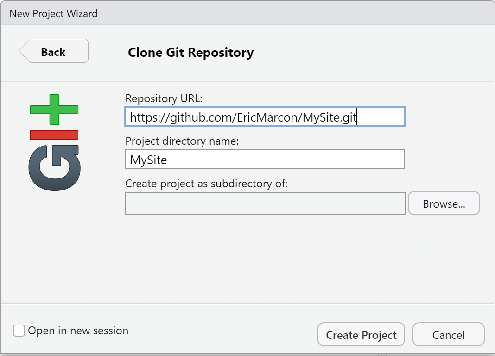

# Rédiger {#chap:rediger}

## Bloc-note Markdown (R Notebook)

Dans un fichier `.R`, le code doit toujours être commenté pour faciliter sa lecture.
Quand l'explication du code nécessite plusieurs lignes de commentaire par ligne ou bloc de code, il est temps d'inverser la logique et de placer le code dans un texte.

L'outil le plus simple est le bloc-note Markdown (Menu "File/New File/R Notebook").
Le modèle de document contient son mode d'emploi.

Le langage qui permet de formater le texte est Markdown [^401], un langage de balisage simple à utiliser:

* Les paragraphes sont séparés par des sauts de ligne;
* Le document est structuré par des titres: leur ligne commence par un nombre de `#` correspondant à leur niveau;
* Les formats de caractères sont limités à l'essentiel: italique ou gras (texte entouré par une ou deux `*`);
* D'autres codes simples permettent tous les formatages utiles.

[^401]: https://fr.wikipedia.org/wiki/Markdown

Ce langage est le pivot du logiciel pandoc [^403], dédié à la conversion de documents de formats différents.

[^403]: https://fr.wikipedia.org/wiki/Pandoc

Le package **rmarkdown** [@Xie2015] fait le lien entre R et Markdown, en s'appuyant sur l'interface de RStudio qui n'est pas indispensable mais simplifie énormément son utilisation.
Le dialecte de Markdown utilisé par le package est appelé *R Markdown*.
Sa syntaxe est résumée dans une antisèche [^402].
Sa documentation complète est en ligne [@Xie2018].

[^402]: https://rstudio.com/wp-content/uploads/2015/02/rmarkdown-cheatsheet.pdf

L'organisation la plus simple d'un document *R Markdown* est visible dans le modèle de bloc-note.
Il commence par un en-tête au format YAML [^404]:

```
---
title: "R Notebook"
output: html_notebook
---
```

[^404]: https://fr.wikipedia.org/wiki/YAML

La première entrée est le titre, la seconde le format de sortie: plus précisément le nom de la fonction chargée de traiter le document.

Le document contient du texte formaté en Markkdown et des bouts de code (*code chunks*) entourés par trois accents graves (la syntaxe markdown d'un bloc de code) et une description du langage, ici `{r]`.
Ces bouts de code sont traités par **knitr** qui transforme le résultat de l'exécution du code R en Markdown et l'intègre au texte du document.

Traiter un document R Markdown s'appelle le *tricoter* (*knit*).
La chaîne de production est la suivante :

* **knitr** traite les bouts de code: calculs, production de figures; 
* **rmarkdown** intègre la production des bouts de code et texte pour produire un fichier Markdown standard;
* pandoc (installé avec RStudio) convertit ce fichier au format HTML, LaTeX ou Word;
* LaTeX produit un fichier PDF quand ce format est demandé.

RStudio permet de lancer le tricot par des boutons plutôt que par des commandes: dans la fenêtre source (celle du haut à gauche), un bouton "Knit" accompagne les documents R Markdown.
Pour les bloc-notes R Markdown, il est remplacé par un bouton "Preview" avec les mêmes fonctions.
Il peut être déroulé pour choisir le format de sortie: HTML, Word, PDF (en passant par LaTeX) et, pour les bloc-notes, une commande "Preview" qui affiche le document en HTML sans exécuter les bouts de code pour gagner du temps.
Dès le premier tricot au format Word ou HTML, on remarquera que le bouton "Preview" disparaît.

Au final, l'utilisation de R Markdown combine plusieurs avantages:

* La simplicité de la rédaction: le texte brut est plus facile à lire et à formater qu'en LaTeX par exemple;
* L'automatisation de la production: le formatage et la mise en page sont entièrement automatiques;
* La reproductibilité: chaque document peut être autosuffisant accompagné de ses données.
Relancer le tricotage régénère entièrement le document, y compris les calculs nécessaires et la production des figures.

Elle a aussi quelques inconvénients: 

* Le formatage dépend de modèles, et developper de nouveaux modèles n'est pas simple;
* Les erreurs de tricot sont parfois difficiles à corriger, notamment quand elles interviennent à l'étape de la compilation LaTeX;
* La reproductibilité consomme du temps de calcul.
Pour limiter ce problème, un système de cache permet de ne pas réévaluer tous les bouts de code R à chaque modification du texte. La production de gros documents peut aussi être déléguée à un système d'intégration continue (chapitre \@ref(chap:ci))


## Modèles R Markdown

Des modèles de document plus élaborés que le bloc-note sont fournis par des packages, dont **rmarkdown**.
Ils sont accessibles par le menu "File > New File > R Markdown..." (figure \@ref(fig:e-rmd1))).

(ref:e-rmd1) Nouveau document Markdown à partir d'un modèle.
```{r e-rmd1, fig.cap="(ref:e-rmd1)", echo=FALSE}
knitr::include_graphics('images/e-rmd1.png')
```

Les modèles les plus simples sont *Document* et *Presentation*.
Les informations à fournir sont le titre et le nom de l'auteur, et le format du document attendu (qui pourra être modifié plus tard).
Ces modèles créent un seul fichier dont l'enregistrement ne sera obligatoire qu'au moment de tricoter.

La syntaxe est la même que celle du bloc-note.
Dans l'entête, une entrée supplémentaire est utilisée pour la date, qui peut être calculée par R à chaque tricot:

```
date: "`r Sys.Date()`"
```

Le code R en ligne (par opposition aux bouts de code) peut être utilisé partout dans un document R Markdown.
Il commence par un guillemet inversé suivi de `r `et se termine par un autre guillement inversé.

Les documents peuvent être tricotés au format HTML, PDF (via LaTeX) ou Word.
L'entête du fichier R Markdown est réécrit quand le tricot est lancé par le bouton de RStudio qui place en premier le format de sortie utilisé et l'ajoute si nécessaire.

Les présentations peuvent être tricotées dans deux formats HTML, ioslide [^407] ou Slidy [^408], au format Beamer (PDF) [^409] ou en Powerpoint [^410].

[^407]: https://bookdown.org/yihui/rmarkdown/ioslides-presentation.html

[^408]: https://bookdown.org/yihui/rmarkdown/slidy-presentation.html

[^409]: https://bookdown.org/yihui/rmarkdown/beamer-presentation.html

[^410]: https://bookdown.org/yihui/rmarkdown/powerpoint-presentation.html

Le niveau 2 de plan (`##`) marque le changement de diapositive.

Du code supplémentaire, présenté dans les documentations des formats HTML, permet d'utiliser des fonctionnalités spécifiques.

Ces modèles sont simples mais assez peu utiles: le bloc-note R est plus facile à utiliser que le modèle de document pour des documents très simples.
Des modèles plus élaborés sont disponibles.


## Memo, article : bookdown

RMarkdown ne permet pas de rédiger un article scientifique.
La bibliographie ne pose pas de problème parce qu'elle est gérée par pandoc pour les documents HTML ou Word et sous-traitée à LaTeX pour les documents PDF. 
Les équations, figures et tableaux sont numérotés par LaTeX mais pas en HTML. 
Les références croisées (les renvois à un numéro de figure par exemple) ne sont pas supportés.
Enfin, les légendes de figures ou tableaux ne supportent que du texte brut, sans aucun formatage.

**bookdown** comble ces manques.
Le package a été conçu pour la rédaction d'ouvrages comportant plusieurs chapitres mais peut être utilisé pour des articles.
Le package ne fournit pas directement de modèles.

Le package **EcoFoG** disponible sur GitHub fournit les modèles présentés ici.
Il doit être installé:
```{r, eval=FALSE}
remotes::install_github("EcoFoG/EcoFoG")
```


### Modèle Memo EcoFoG {#sec:memo}

Le modèle Memo EcoFoG produit un document HTML simple avec une table des matières flottante (voir l'exemple [^430]).
Le format PDF est proche du modèle *article* de LaTeX (exemple[^431]).

[^430]: https://ericmarcon.github.io/Krigeage/Krigeage.html

[^431]: https://ericmarcon.github.io/Krigeage/Krigeage.pdf

Le modèle contient sa propre documentation.

#### Créer

Utiliser  le menu "File > New File > R Markdown..."  puis sélectionner "From template" (figure \@ref(fig:e-rmd1))).
La liste des modèles disponible et le package qui les propose est alors affichée.

Sélectionner le modèle Memo EcoFoG du package **EcoFoG**, choisir le nom du projet ("Name:", qui sera le nom du dossier dans lequel il sera créé, et son dossier parent ("Location:").
Dans l'organisation proposée en section \@ref(sec:solution-dossiers), le dossier parent est `%LOCALAPPDATA%\ProjetsR`.
Le nom du projet ne doit contenir aucun caractère spécial (accent, espace...) pour assurer sa portabilité sur tous les systèmes d'exploitation (Windows, Linux, MacOS).

Les modèles élaborés créent un dossier avec de nombreux fichiers (bibliographie, styles, modèle LaTex...), contrairement aux modèles simples qui créent seulement un fichier.

Quand un dossier est créé, par exemple par le modèle Memo EcoFoG, il faut en faire un projet RStudio: dans le menu des projets (en haut à droite de la fenêtre de RStudio), utiliser le menu "New Project..." puis "Existing Directory" et sélectionner le dossier qui vient d'être créé.


#### Ecrire

Les instructions pour utiliser le modèle sont contenues dans le texte fourni par défaut.

#### Tricoter

Le document peut être tricoté en plusieurs formats:

* html_document2 est le format HTML pour lequel le modèle a été conçu: un bloc-note avec une table des matières flottante;
* gitbook est un format HTML alternatif, utilisé normalement pour les ouvrages;
* pdf_book produit un document PDF suivant le modèle LaTeX *article*, couramment utilisé directement en LaTeX;
* word_document2 crée un ficher Word.


#### Mettre en ligne

Le script `GithubPages.R` fourni avec le modèle place tous les documents tricotés (HTML et PDF) dans le dossier `docs`, avec une copie du fichier `README.md`.
De cette façon, il est possible d'activer les pages GitHub du projet (sur le dossier `docs` de la branche `master`).
Le fichier `README.md` sera la page d'accueil du site web produit.

Le script retourne de nombreux avertissements, sans conséquence, quand un fichier doit être écrasé par exemple.

Pour le projet présenté en exemple, le fichier `README.md` est le suivant:
```
# Krigeage avec R

Techniques pour interpoler les valeurs d'une variable continue.

[Voir le support](https://EricMarcon.github.io/Krigeage/Krigeage.html) ou le [télécharger](https://EricMarcon.github.io/Krigeage/Krigeage.pdf)

```
La première ligne contient le titre, la seconde une description.
Les liens pointent vers le fichier HMTL et le fichier PDF produits, tous les deux dans le dossier `docs`.
Les liens sont absolus, avec l'adresse complète des fichiers, et non relatifs, parce que le fichier `README.md` est le même à la racine du projet (affiché par GitHub en dessous du code) et dans le dossier `docs` (utilisé par les pages GitHuB comme page d'accueil du site).

En pratique, on tricote au format HTML pendant toute la phase de rédaction du mémo, parce que la production est très rapide.
Quand le document est stabilisé, il faut le tricoter au format HTML et au format PDF.
Enfin, l'exécution du script `GithubPages.R` (l'ouvrir et cliquer sur le bouton "Source") place tous les fichiers produits dans `docs`.
Il reste à pousser le dépôt sur GitHub et activer les pages GitHub.

La production des documents a lieu sur le poste de travail, elle n'est pas sous-traitée à un service en ligne (intégration continue, voir plus bas) contrairement à celle des ouvrages, qui nécessitent plus de ressources.


### Autres modèles

Le modèle *Article* d'**EcoFoG** est destiné à la production d'articles PDF pour l'autoarchivage (typiquement, le dépôt sur HAL) bien formatés, au format A4 en double colonne [^440].

[^440]: Exemple: https://ericmarcon.github.io/Rochebrune2018/Entropie.pdf

Le format HTML est le même que celui du modèle de mémo.

Le package **rticles** a pour ambition de fournir des modèles pour toutes les revues scientifiques qui acceptent une soumission d'articles en LaTeX.
Il propose donc des modèles Markdown qui produisent des fichiers PDF conformes aux exigences des revues et la possibilité de récupérer le fichier `.tex` intermédiaire (pandoc produit un fichier `.tex` transmis au compilateur LaTeX).
Le package ne permet pas de tricot HTML parce qu'il utilise la syntaxe LaTeX dans le document RMarkdown au lieu d'utliser **bookdown** pour gérer les références bibliographique et les réferences croisées.
Il n'est pas possible d'échanger directement du contenu RMarkdown standard avec des documents écrits pour **rticles**, ce qui limite beaucoup l'intérêt du package.


## Présentation EcoFoG : bookdown

Le modèle Présentation EcoFoG permet de créer des présentations au format HTML et PDF (beamer) simultanément, comme le montre l'exemple [^432].

[^432]: https://ericmarcon.github.io/Chao1/, choisir Lecture (HTML) ou Téléchargement (PDF).

La démarche est identique à celle du Memo EcoFoG.
Les niveaux de titre permettent de séparer les parties de la présentation (`#`) et les diapositives (`##`).
Deux formats sont disponibles en HTML: ioslides [^433] et Slidy [^434].
Quelques spécificités dans le code permettent d'affiner la présentation des diapositives, pour un affichage sur deux colonnes par exemple: elles sont documentées dans le modèle.

[^433]: https://bookdown.org/yihui/rmarkdown/ioslides-presentation.html

[^434]: https://bookdown.org/yihui/rmarkdown/slidy-presentation.html


## Ouvrage EcoFoG : bookdown

Le modèle d'ouvrage est destiné aux documents longs, qui présentent une différence importante avec les documents précédents: un document long est composé de plusieurs chapitres, chacun placé dans son fichier `.Rmd`.

Le format HTML est gitbook [^441], le standard de la lecture en ligne de documents de ce type. Le format PDF est dérivé du modèle LaTeX *memoir* [^442], optimisé aussi pour les documents longs.

[^441]: https://www.gitbook.com/

[^442]: https://www.ctan.org/pkg/memoir

Ce document a été écrit avec ce modèle.


### Créer

La création d'un projet d'ouvrage est identique à celle présentée plus haut: le modèle est: Ouvrage EcoFoG.
Le dossier créé doit être transformé en chapitre, comme pour un Memo EcoFoG.

Chaque chapitre de l'ouvrage  est un fichier Rmd, dont le nom commence normalement par son numéro (ex.: `01-intro.Rmd`).
Tous les fichiers Rmd présents dans le dossier du projet sont en réalité traités comme des chapitres, triés par ordre de nom de fichier, dont ceux fournis par le modèle (démarrage et syntaxe) qui doivent être supprimés à l'exception de `99-references.Rmd` qui contient la bilibiographie, placée à la fin.
Le fichier `index.Rmd` est particulier: il contient l'entête du document et le premier chapitre.


### Ecrire

Ce premier chapitre est placé dans l'avant-propos de l'ouvrage imprimé: il ne doit pas être numéroté (d'où le code `{-}` à côté du titre) dans la version HTML. Il se termine obligatoirement par la commande LaTeX `\mainmatter` qui marque le début du corps de l'ouvrage.

Les niveaux de plan commencent sont `#` pour les chapitres (un seul par fichier), `##` pour les sections, etc.


### Tricoter

La compilation au format PDF est faite par XeLaTeX, qui doit être installé.

Pendant la rédaction, il est fortement conseillé de ne créer que le fichier HTML, ce qui est beaucoup plus rapide qu'une compilation LaTeX.
Chaque chapitre peut être visualisé très rapidement en cliquant sur le bouton _Knit_ au-dessus de la fenêtre de source.
Le livre entier est créé en cliquant sur le bouton *Build Book* de la fenêtre *Build* de RStudio.
La liste déroulante du bouton permet de créer tous les documents ou de se limiter à un format.

Les fichiers produits sont placés directement dans le dossier `docs`, qui sera utilisé par les pages GitHub pour permettre la lecture en ligne et le téléchargement du PDF.
La page d'accueil du site web est créée par bookdown à partir du fichier `index.Rmd`: le fichier `README.md` n'est pas dupliqué dans `docs` le script `GithubPages.R` ne doit pas être utilisé (il n'est pas fourni dans le modèle).


### Intégration continue {#sec:rediger-ouvrage-ci}

La construction d'un ouvrage prend du temps, surtout s'il contient des calculs.
Elle doit être lancée au format gitbook et au format PDF.
En production, elle peut être confiée à Travis-CI (chapitre \@ref(sec:bookdown-ci)).


## Site web R Markdown

Un site web constitué de pages écrites avec R Markdown (sans les fonctionnalités de **bookdown**) et un menu peut être créé très simplement, avec un résultat de bonne facture [^425].

[^425]: Exemple : https://rstudio.github.io/learnr/


### Modèle

Dans RStudio, dans le menu des projets en haut à droite, cliquer sur *New Project...* puis "New Directory" puis "Simple R Markdown website".
Saisir le nom du projet, sélectionner le dossier dans lequel le projet sera créé en cliquant sur "Browse" et enfin cliquer sur "Create Project".

Le site par défaut contient deux pages: `index`, la page d'accueil, et `about`, la page "A propos". 
Le fichier `_site.yml` contient le nom du site et le contenu de sa barre de navigation: un titre et le fichier correspondant. 
D'autres pages seront ajoutées en créant de nouveaux fichiers `.Rmd` et en les ajoutant au fichier `_site.yml`.


### Améliorations

Le modèle de site peut facilement être amélioré en complétant `_site.yml`:

* en ajoutant une icône GitHub dans la barre de navigation pour renvoyer vers le code source du site:
* en choisissant la méthode de tricot des pages, pour utiliser **bookdown** au lieu de **rmarkdown**;
* en plaçant les fichiers du site dans le dossier `docs` et ainsi séparer le code et la production.

Le fichier `_site.yml` complété est le suivant:
```
name: "my-website"
navbar:
  title: "My Website"
  left:
    - text: "Home"
      href: index.html
    - text: "About"
      href: about.html
  right:
    - icon: fa-github
      href: https://github.com/rstudio/rmarkdown
output_dir: "docs"
output:
  bookdown::html_document2:
    theme: sandstone
    highlight: tango
    toc: true
    toc_float: yes
```

L'icône de GitHub fait partie de la collection Font Awesome dont toutes les icônes gratuites [^426] sont utilisables avec la même syntaxe: "fa-nom".

[^426]: https://fontawesome.com/icons?d=gallery&m=free

Le lien correspondant à l'icône doit être celui du dépôt GitHub du site web.

La syntaxe de la section `output` est la même que celle des documents vus plus haut, comme le mémo EcoFoG.
Elle s'applique à toutes les pages (dont l'entête YAML est réduite au minimum).
Les thèmes disponibles sont ceux de rmarkdown [^427].

[^427]: https://bookdown.org/yihui/rmarkdown/html-document.html#appearance-and-style

L'option `highlight` indique la façon dont le code R éventuellement affiché sera formaté.
Enfin, la table des matières est flottante, ce qui signifie que sa position s'ajuste quand la fenêtre défile.


### Contôle de source

Le projet doit être placé sous contrôle de source et poussé sur GitHub (chapitre \@ref(chap:git)).
Le fichier `.gitignore` est le suivant :
```
# R
.Rbuildignore
.RData
.Rhistory
.Rprofile
.Rproj.user

# Web Site
/_site/
/*_cache/
/*_files/

```
Activer les pages GitHub (section \@ref(sec:github-pages)) sur le dossier `docs` pour héberger le site.
Ajouter un fichier vide nommé `.nojekyll` dans `docs` pour que les pages GitHub ne tentent pas de reformater le site.
On peut uliser le terminal de RStudio pour exécuter:
```
touch docs/.nojekyll
```


## Site web personnel : blogdown {#sec:blogdown}

Pour créer une page web personnelle, *Hugo* est un générateur de site statique capable de produire des pages HTML à partir de code Markdown.
Les sites statiques ont l'avantage, en comparaison aux sites dynamiques gérés par un système de gestion de contenu (CMS, par exemple: Wordpress, Joomla, SPIP), d'être portables sur n'importe quel serveur web sans support de base de données ni de code à exécuter côté le serveur (tel que PHP) et d'être très rapides puisque les pages sont créées une seule fois et non à chaque consultation.
Un site Hugo peut être hébergé par exemple sur la page personnelle de tout utilisateur de GitHub dont l'adresse est de la forme "NomUtilisateur.github.io".

Hugo propose de nombreux thèmes, qui sont des modèles de structure de sites, donc le thème **Academic**, destiné aux chercheurs.
Dans RStudio, le package **blogdown** est prévu pour produire facilement des pages web avec Hugo.
Ces pages peuvent contenir du code R: elles sont très proches d'un Memo EcoFoG dont le contenu peut être facilement copié et collé.
Nous utiliserons donc cette solution, pour un site comme celui proposé en exemple [^411].

[^411]: https://ericmarcon.github.io/

La structure du site web est simple:

* une page d'accueil, contenant divers composants paramétrables comme la biographie de l'auteur, une sélection de publications, de billets de blogs ou d'autres éléments et un formulaire de contact;
* des pages détaillant les divers éléments (publications, billets, etc.) écrites en RMarkdown.


### Installation des outils

La première étape consiste à installer le package **blogdown** dans R.

```{r blogdown, eval=FALSE}
install.packages('blogdown') 
```

**blogdown** est capable d'installer Hugo sous Windows, macOS ou Linux.
```{r Hugo, eval=FALSE}
blogdown::install_hugo()
```

Par la suite, la mise à jour de Hugo pourra être faite par:
```{r mqjHugo, eval=FALSE}
blogdown::update_hugo()
```
La documentation complète de **blogdown** est disponible [^412].

[^412]: https://bookdown.org/yihui/blogdown/

Les versions récentes de Hugo utilisent *Go* (le langage de programmation) pour installer leurs modules à la volée: ici le thème Academic est chargé depuis GitHub au moment de la création du site.
Go doit donc être installé [^414].

[^414]: https://golang.org/doc/install


### Créer

La façon la plus simple consiste à créer un dépôt sur GitHub à partir du modèle.
Sur la page du dépôt *starter-academic* [^413], cliquer sur le bouton "Use this template", s'authentifier éventuellement sur GitHub, puis saisir le nom du dépôt qui contiendra le projet, par exemple "MySite".
Créer le dépôt.
Copier l'adresse du dépôt en cliquant sur le bouton "Code" puis sur le bouton à droite de l'adresse (figure \@ref(fig:rediger-GitHub-Clone)).

(ref:rediger-GitHub-Clone) Copie de l'adresse d'un dépôt à cloner sur GitHub.
```{r rediger-GitHub-Clone, fig.cap="(ref:rediger-GitHub-Clone)", echo=FALSE}
knitr::include_graphics('images/rediger-GitHub-Clone.png')
```

[^413]: https://github.com/wowchemy/starter-academic

Dans RStudio, créer un nouveau projet à partir de GitHub: dans le menu des projets en haut à droite, cliquer sur *New Project...* puis *Version Control* puis *Git* puis coller l'adresse dans le champ "Repository URL" (figure \@ref(fig:rediger-Projet-GitHub)).
Sélectionner le dossier dans lequel le projet sera créé en cliquant sur "Browse" et enfin cliquer sur "Create Project".

(ref:rediger-Projet-GitHub) Copie de l'adresse d'un dépôt à cloner sur GitHub.
```{r rediger-Projet-GitHub, fig.cap="(ref:rediger-rediger-Projet-GitHub)", echo=FALSE}

```

Le projet créé est une copie exacte du modèle, qui doit être personnalisée.

RStudio ajoute automatiquement à la fin du fichier `.gitignore` une ligne pour ignorer ses fichiers de travail (dossier `.Rproj.user`).
Ajouter une ligne de commentaire pour le signaler.
Le contenu de `.gitignore` doit être le suivant:

```
# R
.Rbuildignore
.RData
.Rhistory
.Rprofile
.Rproj.user

# Hugo
/resources/
/public/

# blogdown
/static/en/
/static/fr/
*.rmarkdown
_index.html
index.html
```

Un bug de **blogdown** nécessite de déplacer le fichier `config/_default/config.toml` à la racine du projet.

Prendre en compte ces modification dans git en faisant un commit.

Exécuter 
```{r, eval=FALSE}
blogdown:::serve_site()
```
pour construire le site web.
Il apparaît dans la fenêtre *Viewer* de RStudio, dont le bouton d'agrandissement permet l'affichage dans le navigateur internet par défaut du système.

Pour modifier le contenu du site, il est préférable d'arrêter le serveur web par la commande:
```{r, eval=FALSE}
blogdown:::stop_server()
```

Si le site est multilingue (Français et Anglais par exemple), son contenu (dossier `content`) doit être copié dans un dossier correspondant à chaque langue.
Par exemple, le fichier `content/authors/admin/_index.md` qui contient les informations sur le propriétaire du site est remplacé par `content/en/authors/admin/_index.md` et `content/fr/authors/admin/_index.md` si le site supporte l'Anglais et le Français.
En pratique, créer un dossier `en` et un dossier `fr` dans `content`.
Copier tout le contenu de content (sauf les deux nouveaux dossiers) dans `en` puis déplacer ce même contenu dans `fr`.

### Paramétrer

Les fichiers de configuration du site sont bien documentés et offrent de nombreuses options.
Les principales sont passées en revue ici pour une création rapide d'un site fonctionnel.

Le fichier `config.toml` contient les paramètres généraux du site.
Les lignes à mettre à jour sont celle du titre du site (le nom du propriétaire puisqu'il s'agit d'un site personnel) et son adresse publique. Pour le site exemple :
```{r}
title = "Eric Marcon"
baseurl = "https://ericmarcon.github.io/"
```

Il contient aussi la ligne de sélection de la langue par défaut ("en" ou "fr" au choix) et celle qui permet de placer les fichiers produits par Hugo dans chaque dossier de langue ("true" obligatoirement pour un site multilingue):
```
defaultContentLanguage = "fr"
defaultContentLanguageInSubdir = true
```

Le dossier `config/_default/` contient les autres fichiers de configuration.

`languages.toml` contient les paramètres linguistiques et les traductions de menus.
Pour chaque langue, la version utilisée et le dossier de contenu sont précisés:
```
[en]
  languageCode = "en-us"
  contentDir = "content/en"
[fr]
  languageCode = "fr-fr"
  contentDir = "content/fr"
```

Pour les langues additionnelles, le titre du site, les paramètres d'affichage des dates et la traduction des menus sont ajoutés.
Dans la section `[fr]`:
```
[en]
  languageCode = "en-us"
  contentDir = "content/en"
[fr]
  languageCode = "fr-fr"
  contentDir = "content/fr"
```

Ces lignes sont commentées dans le modèle et doivent dont être décommentées en retirant les `#` en têtes de lignes.

Les menus sont décrits plus bas.

`params.toml` décrit l'aspect du site.
Les options sont regroupées par sujet, par exemple "Theme" pour l'apparence générale.
Dans "Basic Info", la ligne 
```
site_type = "Person"
```
sélectionne un site personnel.
Il est possible d'utiliser Academic pour un site de projet scientifique ou un site d'unité, non documentés en détail ici.
Les principales différences sont, pour un site collectif:

* la gestion des auteurs: dans le dossier `/contents/<langue>/authors`, un seul dossier `admin` est utilisé pour un site personnel alors qu'un dossier par personne est nécessaire pour un site collectif;
* un composant décrit plus bas, qui permet de présenter les personnes, doit être activé.

La description du site dans la langue par défaut est saisie, à destination des moteurs de recherche:
```
description = "Eric Marcon's Homepage"
```

Elle doit être traduite dans le fichier `languages.toml`, dans chaque langue.

Dans "Site Features", nous sélectionnons la coloration du code R, l'activation du formatage des équations et l'avertissement légal pour l'utilisation des cookies.
```
highlight_languages = ["r"] 
math = true
privacy_pack = true
```

La ligne `edit_page` doit être mise à jour: remplacer le dépôt par défaut "https://github.com/gcushen/hugo-academic" par celui du site.

"Contact details" contient les informations pour contacter le propriétaire du site.
Elles doivent être saisies.

"Regional Settings" contient les paramètres d'affichage de date pour la langue par défaut (ceux des autres langues sont dans `languages.toml`).
Ils n'ont normalement pas à être modifiés.

"Comments" permet d'activer les commentaires des visiteurs en bas de pages, avec Disqus ou Comment.io (un compte est nécessaire chez le fournisseur). "Marketing" permet d'activer le suivi de fréquentation du site en saisissant simplement son identifiant Google Analytics (à créer avec un compte Google).
"Content Management System" contient la ligne `netlify_cms` dont la valeur doit être `false` si le site n'est pas hébergé par Netlify. Enfin "Icon Pack Extensions" permet d'activer les icônes Academicons si nécessaire.


### Ecrire

Utiliser la documentation en ligne [^415] en complément des informations principales détaillées ici.
L'exemple utilisé ici est le site personnel de l'auteur [^416].

[^415]: https://wowchemy.com/docs/page-builder/

[^416]: https://ericmarcon.github.io/

La méthode de travail consiste à progresser pas à pas en testant puis validant chaque étape:

* Effectuer les modifications;
* Construire le site et vérifier le résultat: `blogdown:::serve_site()`;
* Arrêter le site: `blogdown::stop_server()`;
* Si le résultat n'est pas satisfaisant, recommencer;
* Valider les modifications (*commit*).


#### Page d'accueil

La page d'accueil du site est constituée par une suite d'éléments (*widgets*) qui se trouvent dans `/contents/<langue>/home`.
Chaque élément est décrit par un fichier markdown.
Le premier est `index.md`.
Il n'est normalement jamais modifié.
Son contenu est le suivant:
```
+++
# Homepage
type = "widget_page"
headless = true  # Homepage is headless, other widget pages are not.
+++
```

Le fichier ne contient qu'un entête au format TOML, encadré par une ligne de `+++`.
Le type de composant (`type`) indique qu'il s'agit d'une page de composants, dans laquelle les autres composants du dossier trouveront leur place.
`headless = true` signifie que la page n'a pas d'en-tête.

(ref:rediger-demo) Composant `demo` dans Academic.
```{r rediger-demo, fig.cap="(ref:rediger-demo)", echo=FALSE}
knitr::include_graphics('images/rediger-demo.png')
```

Le composant `demo.md` (figure \@ref(fig:rediger-demo)) est un composant de type "blank", c'est-à-dire une page de texte libre: il sert ici à présenter le modèle Academic Kickstart et doit donc être désactivé.
L'entête contient ses informations de formatage (titre, nombre de colonnes, couleurs...) et le contenu de la page est écrit en markdown.
Les composants apparaissent par ordre croissant de poids (`weight` dans l'entête): 15 marque le premier composant dans le modèle Academic.
Le composant peut être désactivé en supprimant son fichier ou en modifiant sa propriété `active` dans l'entête:
```
active = false  # Activate this widget? true/false
```

(ref:rediger-about) Composant `about` dans Academic.
```{r rediger-about, fig.cap="(ref:rediger-about)", echo=FALSE}
knitr::include_graphics('images/rediger-about.png')
```

Le composant suivant est `about.md` (figure \@ref(fig:rediger-about)).
Il présente le propriétaire du site.
Son titre doit être localisé.
Dans le dossier `/content/fr/home`, sa valeur sera:
```
title = "Biographie"
```

L'auteur (`author`) doir correspondre à un dossier de `/contents/<langue>/authors`.
`admin` convient parfaitement pour un site personnel.
Academic permet de créer des sites d'équipes: dans cette configuration, un dossier par personne serait nécessaire.
L'image affichée par le composant est le fichier `avatar.jpg` placé dans ce dossier.
Limiter la taille du fichier pour la performance du site (moins d'un mégaoctet est une taille raisonnable), tout en assurant une taille minimale de quelques centaines de pixels de côté pour la qualité de l'affichage.

Le contenu du composant est lu dans le fichier `_index.md` du même dossier, qui contient toutes les informations sur l'auteur.
Son organisation est assez claire: modifier son contenu à partir de l'exemple fourni.
Si des icônes de type `ai` sont utilisées, activer le pack d'icône Academicons dans `config/_default/params.toml`.

(ref:rediger-skills) Composant `skills` dans Academic.
```{r rediger-skills, fig.cap="(ref:rediger-skills)", echo=FALSE}
knitr::include_graphics('images/rediger-skills.png')
```

Le composant talents (`skills`, figure \@ref(fig:rediger-skills)) présente les compétences de l'auteur de façon graphique.
Une collection d'icônes est disponible, et des icônes nouvelles peuvent être ajoutées.

(ref:rediger-experience) Composant `experience` dans Academic.
```{r rediger-experience, fig.cap="(ref:rediger-experience)", echo=FALSE}
knitr::include_graphics('images/rediger-experience.png')
```

Le composant expérience (`experience`, figure \@ref(fig:rediger-experience)) liste les expériences professionnelles. 
Toutes les informations sont saisies dans son entête.

Le composant `accomplishments` présente les formations professionnelles et permet d'accéder à leurs certificats.

Le composant `posts` va chercher son contenu dans le dossier `/contents/<langue>/post` qui contient les billets de blog (voir plus bas).
Le fichier `posts.md` contient des options de mise en page dans son entête.

Le composant `projects` fonctionne de la même façon.
La différence entre les deux composants est leur mise en forme: `posts` est du type "pages", qui affiche les éléments les plus récents, alors que `projects` est de type "portfolio", qui affiche les éléments sélectionnés qui contiennent la description `featured: true` dans leur propre entête.
Il est possible de créer des composants de ces types librement, en spécifiant le dossier contenant les éléments dans "page-type".
Exemple: créer un composant nommé `software.md` en renommant `projects.md`, modifier sa ligne `page_type = "software"` et créer un dossier `/contents/<langue>/software` pour y placer du contenu.

Les composants `publications` et `featured` sont respectivement de type "pages" et "portfolio" et prennent leur contenu dans le dossier `publication`.

Le composant `tags` présente un nuage de mots à partir des mots-clés déclarés dans tous les fichiers de contenu (billets de blog, publications...) sous la forme suivante dans leur entête:
```
tags = ["Mot Clé 1", "Autre Mot Clé"]
```

Enfin, le composant `contact` permet d'afficher un formulaire de contact.
Il utilise les informations du fichier `config/_default/params.toml` dans sa partie commençant par:
```
############################
## Contact details
##
```
Pour afficher une carte, entrer la latitude et la longitude de l'adresse dans la ligne `coordinates`.
Pour afficher un formulaire de messagerie, choisir le service *formspree.io* (`email_form = 2` dans `contact.md`).
Pour activer le service de messagerie, il faudra construire le site web, s'envoyer un premier message en utilisant le formulaire et suivre les instructions de Formspree.

Le composant `people` est utilisé dans les sites collectifs pour présenter les membres.
Le composant `slider` permet d'afficher un carrousel (des éléments défilants) en haut de page.
Pour comprendre son fonctionnement, le plus simple consiste à l'activer.


#### Menu de la page d'accueil

La page d'accueil comporte un menu qui permet de naviguer rapidement vers ses composants ou vers d'autres pages.
Il est paramétré dans `config/_default/menus.toml`.
Les éléments du menu ont un nom affiché, un lien (commençant par `#` pour pointer vers un composant ou un chemin relatif dans le site comme `publication/`), et un poids qui définit leur ordre d'affichage, de la même façon que celui des composants de la page d'accueil.

Un menu à deux éléments pour pointer vers l'accueil du site et les billets de blogs est donc le suivant:
```
[[main]]
  name = "Home"
  url = "#about"
  weight = 10

[[main]]
  name = "Posts"
  url = "#posts"
  weight = 20
```

Le menu doit être traduit dans chaque langue dans le fichier `config/_default/languages.toml`:
```
[fr]
  [[fr.menu.main]]
    name = "Accueil"
    url = "#about"
    weight = 10
  [[fr.menu.main]]
    name = "Articles"
    url = "#posts"
    weight = 20
```

#### Billets

Le site est alimenté par des billets de blog placés dans le dossier `/contents/<langue>/post`.
Il doivent être traduits et placés dans le dossier `post` de chaque langue pour être disponibles dans la langue correspondante.
L'exemple utilisé ici est un guide pour estimer correctement la densité d'une variable bornée [^417].

[^417]: https://ericmarcon.github.io/post/densite/

Son code est sur GitHub [^418].

[^418]: https://github.com/EricMarcon/HomePage2020/tree/master/content/fr/post/densite

Un billet est placé dans un dossier (`/content/fr/post/densite`) qui contient son code Rmarkdown et éventuellement des images, des données pour alimenter le code et d'autres éléments appelés par le code.
Hugo supporte des fichiers markdown natifs.
L'apport de **blogdown** relativement à un site Hugo natif est le support de Rmarkdown, donc la possibilité d'exécuter tout code R comme dans un bloc-note (dont le contenu peut être réutilisé sans modification).

Le fichier principal d'un billet est `index.Rmd`.
**blogdown** crée un fichier `index.html` pendant la construction du site: il peut être ignoré (dans `.gitgnore`) et supprimé à tout moment.
Si une image `featured.png` (optimale pour un schéma) ou `featured.jpg` (optimale pour un photo) est placée dans le dossier, elle sera utilisée comme vignette du billet.

`index.Rmd` comprend un entête au format yaml (entourée par des `---`) ou toml (entourée par des `+++`) qui décrit son affichage:
```
---
title: "Titre du billet"
subtitle: "Sous-titre"
summary: "Résumé"
authors: []
tags: ["Mot Clé 1", "Autre Mot Clé"]
categories: []
date: 2020-04-17
featured: false
draft: false

# Featured image
# To use, add an image named `featured.jpg/png` to your page's folder.
# Focal points: Smart, Center, TopLeft, Top, TopRight, Left, Right, BottomLeft, Bottom, BottomRight.
image:
  caption: ""
  focal_point: ""
  preview_only: false
  
bibliography: references.bib
---
```

Les auteurs sont utilisés dans les sites collectifs. 
Les tags permettent d'alimenter le composant nuage de mots s'il est activé dans la page d'accueil.
Les catégories permettent de rechercher des pages au contenu similaire (recherche par mot-clé sur le site).
L'option `featured: true` fait apparaître le billet dans les composants de type `featured` sur la page d'accueil.
L'option `draft: true` cache le billet.

Les éléments suivants précisent l'affichage de la vignette: légende et position.
L'option `preview_only: true` limite l'affichage aux miniatures (sur la page d'accueil), retirant donc l'image du billet lui-même.

Les éléments d'entête nécessaires au corps de texte RMarkdown, comme le nom du fichier contenant les références bibliographiques, placé dans le même dossier, sont ajoutés.

Le corps du texte est celui d'un document RMarkdown standard, avec du code R inclus.
Un bout de code initial permet de fixer les options de R et charger les packages nécessaires.

En pratique, la façon la plus efficace de créer un nouveau billet est de copier le dossier complet d'un billet précédent, de le renmmer et de modifier son contenu.
La commande `blogdown::new_post()` peut aussi être utilisée mais ne gère pas les langues multiples (et crée donc le billet dans le dossier `/contents/post` à moins de préciser l'argument `subdir`).

#### Publications

Les publications sont organisées comme les billets, mais placées dans le dossier `/contents/<langue>/publications`.

L'exemple utilisé est un article de revue [^419] avec son code [^420].

[^419]: https://ericmarcon.github.io/publication/marcon-2003-a/

[^420]: https://github.com/EricMarcon/HomePage2020/tree/master/content/fr/publication/marcon-2003-a

Un fichier `cite.bib` contenant la référence au format BibTex est placé dans le dossier.
Le nom du dossier est de préférence celui de l'identifiant de la publication.
L'entête du fichier `index.md` (ici au format Markdown, mais `.Rmd` est possible si du code R est nécessaire) contient les mêmes informations que le fichier BibTex, mais au format approprié (yaml), et les éléments propres à Academic (`featured`):
```
---
title: "Evaluating the geographic concentration of industries using distance-based methods"
authors: ["Eric Marcon", "Florence Puech"]
publication_types: ["2"]
abstract: "We propose (...)"
publication: "*Journal of Economic Geography*"
doi: "10.1093/jeg/lbg016"

date: 2003-10-01
featured: false
---
```

Les types de publication sont:

* 0 = Uncategorized;
* 1 = Conference paper;
* 2 = Journal article;
* 3 = Preprint / Working Paper;
* 4 = Report;
* 5 = Book;
* 6 = Book section;
* 7 = Thesis;
* 8 = Patent.

Des boutons sont affichés en haut de la page de la publication en fonction des informations trouvées :

* PDF: si la ligne `url` est présente dans l'en-tête;
* Citation: si le fichier `cite.bib` est orésent dans le dossier;
* DOI: si la ligne `doi` est présente dans l'en-tête.


Le corps de la publication contient un lien (au format HTML) vers le site Dimension qui fournit des informations bibliométriques.
Ce lien peut être réutilisé très simplement, en remplaçant simplement le DOI du document:
```
<span class="__dimensions_badge_embed__" data-doi="10.1093/jeg/lbg016"></span>
<script async src="https://badge.dimensions.ai/badge.js" charset="utf-8"></script>
```

Enfin, un fichier `/contents/<langue>/publications/_index.Rmd` permet de présenter la bibliographie complète.
Il est accessible à partir du composant `publications` de la page d'accueil qui affiche un lien "Plus de Publications".

Le fichier exemple [^421] avec son code [^422] permet d'interroger Google Scholar pour obtenir le réseau de coauteurs, l'indice h et le nombre de citations annuelles de l'auteur.
Il est réutilisable en modifiant simplement l'identifiant Google Scholar à la ligne 30.

[^421]: https://ericmarcon.github.io/publication/

[^422]: https://github.com/EricMarcon/HomePage2020/tree/master/content/fr/publication/marcon-2003-a

En faisant exécuter le code régulièrement, par exemple par Travis-CI (voir ci-dessous), les statistiques affichées sont maintenues à jour sans intervention humaine.


#### Communications

Les communications sont organisées comme les publications, dans le dossier `/contents/<langue>/talk`.

L'exemple utilisé est une communication en Français, donc dans `/contents/fr/talk` [^423] avec son code [^424].

[^423]: https://ericmarcon.github.io/talk/chao1/

[^424]: https://github.com/EricMarcon/HomePage2020/tree/master/content/fr/talk/chao1

Une image peut être utilisée plus facilement que pour une publication.

L'entête contient des lignes particulières adaptées aux communications:
```
---
title: "Construction de l'estimateur de biodiversité Chao1"
event: "Semaine des mathématiques 2020"
event_url: https://eduscol.education.fr/cid59178/semaine-des-mathematiques.html

location: Université de Guyane

summary: []
abstract: |
  Pour estimer le nombre d’espèces (richesse spécifique) d’une communauté 
  à partir d’un échantillon, l’estimateur Chao1 est l’outil le plus utilisé.

  Sa construction est expliquée et son efficacité est testée sur des données simulées.

# Talk start and end times.
#   End time can optionally be hidden by prefixing the line with `#`.
date: "2020-03-11T11:00:00Z"
date_end: "2020-03-11T12:00:00Z"
all_day: false

# Schedule page publish date (NOT talk date).
publishDate: "2020-04-14"

# Is this a featured talk? (true/false)
featured: false

image:
  caption: 'Produit scalaire des vecteurs $v_0$ et $v_2$'
  focal_point: Smart

url_code: "https://github.com/EricMarcon/Chao1"
url_pdf: "https://ericmarcon.github.io/Chao1/Chao1.pdf"
url_slides: "https://ericmarcon.github.io/Chao1/Chao1.html"


# Enable math on this page?
math: true
---
```
Les liens (`url_code` par exemple) font apparaître des boutons qui permettent d'afficher respectivement le code source de la présentation, un fichier pdf et les diapositives en ligne.


#### Autres éléments

Il est possible d'ajouter librement des éléments supplémentaires sur le site:

* dans `/contents/<langue>/`, créer un dossier dont le nom est le type d'éléments (exemple: `recette`);
* ajouter des éléments dans ce dossier, chacun dans son propre dossier;
* le fichier obligatoire est `index.md` ou `index.Rmd` avec un en-tête contenant possiblement tous les champs rencontrés dans les éléments `post`, `publication` et `talk`;
* le fichier de vignette, `featured.png` ou `featured.jpg`, est facultatif;
* tous les fichiers nécessaires au tricot (images, données) peuvent être ajoutés dans le même dossier;
* dans `/contents/<langue>/home`, ajouter un composant de la page d'accueil en copiant-collant un élément existant de type "pages" (comme `publications`) ou "portfolio" (comme `featured`) et le paramétrer pour qu'il pointe sur le bon dossier (dans l'exemple: `page-type=recette`) et ajuster son apparence (nombre d'éléments par exemple) et sa position (poids);
* ajouter éventuellement une entrée de menu pour pointer sur le composant, avec le même poids que le composant.

Les fichiers d'index peuvent porter l'extension `.Rmd` ou `.md`.
Dans le premier cas, ils seront traités par **blogdown**, qui supporte l'intégration de code R.
Dans l'autre cas, ils seront traités par Hugo, qui ne gère que le format markdown standard.
Les fichiers `.md` nécessitent moins de ressource et sont donc préférés quand ils suffisent.


#### Finitions

L'icône du site, qui apparaît dans la barre d'adresse des navigateurs web, se trouve dans `assets/images`.
Le fichier `icon.png` peut être remplacé.


### Intégration continue {#sec:rediger-web-ci}

La construction du site web en production peut être confiée à Travis-CI (section \@ref(sec:blogdown-ci)), y compris sa mise à jour périodique si des pages du site traitent des données qui évoluent dans le temps.

