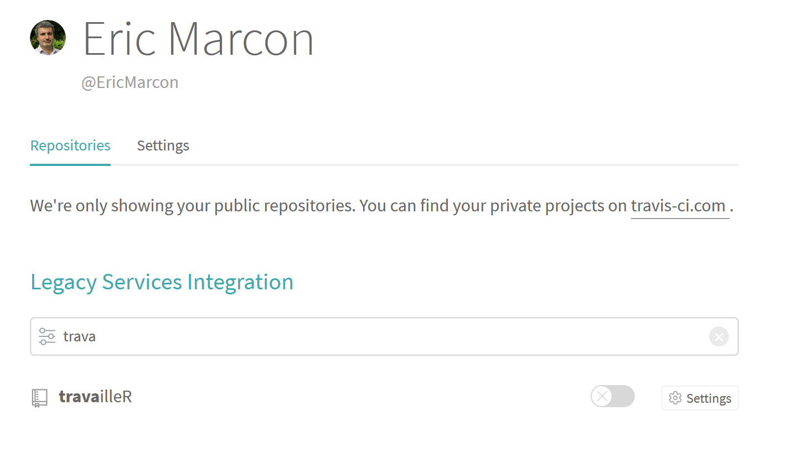

# Intégration continue {#chap:ci}


## Principes

### Objectifs

L'intégration continue consiste à confier à un service externe la tâche de vérifier un package, produire des documents Markdown pour les pages web d'un dépôt GitHub ou tricoter entièrement un site web à partir du code.

Toutes ces tâches peuvent être accomplies localement sur le poste de travail mais prennent du temps et risquent de ne pas être répétées à chaque mise à jour.
Dans le cadre de l'intégration continue, elles le sont systématiquement, de façon transparente poru l'utilisateur.
En cas d'échec, un message d'alerte est envoyé.

La mise en place de l'intégration continue se justifie pour des projets lourds, avec des mises à jour régulières. plutôt que pour des projets contenant un simple document Markdown rarement modifié. 


### Outils

L'outil utilisé le plus fréquemment pour des projets R déposés sur GitHub est *Travis CI* [^601].

[^601]: https://travis-ci.org/

Il est nécessaire d'ouvrir un compte sur le site.
Il est possible de s'authentifier avec son compte GitHub pour limiter le nombre de mots de passe.

Pour évaluer le taux de couverture du code des packages R, c'est-à-dire la proportion du code testé d'une façon ou d'une autre (exemples, tests unitaires, vignette), le service *Codecov* [^602] s'intègre parfaitement à Travis.

[^602]: https://codecov.io/

Il faut là encore ouvrir un compte, de préférence en s'authentifiant par GitHub.


### GitPages

Les pages web de GitHub peuvent être hébergées dans le répertoire `docs` de la branche master du projet: c'est la solution retenue quand elle sont produites sur le poste de travail.

Si elles sont produites par Travis, elle le seront obligatoirement dans une branche dédiée appelée `gh-pages`.


## Intégration continue d'un projet de document

L'objectif est de faire tricoter par Travis un projet Markdown, comme ce document.
Dans ce type de projet, le code est tricoté par knitr pour produire plusieurs documents, typiquement aux formats HTML et PDF, accessibles sur les pages Git.
Quand les documents sont produits localement, ils sont placés dans le dossier `docs` et poussés sur GitHub.

Pour que Travis s'en charge, quelques réglages sont nécessaires. 


### Obtention d'un jeton d'accès personnel

Pour écrire sur GitHub, le service d'intégration continue devra s'authentifier au moyen d'une clé privée, appelée *Personal Access Token* (PAT).

Les jetons sont créés sur GitHub, dans les paramètres de son compte d'utilisateur, dans *Developer Settings, Personal Access Tokens" [^603].

[^603]: https://help.github.com/en/github/authenticating-to-github/creating-a-personal-access-token-for-the-command-line

Générer un nouveau jeton, le décrire en tant que "Travis" et lui donner l'autorisation "repo", c'est-à-dire modifier *tous* les dépôts (il n'est pas possible de limiter l'accès à un dépôt particulier). 
Le jeton est une chaîne de caractère qui ne pourra pas être relue plus tard: elle doit être sauvegardée comme un mot de passe.


### Activation du dépôt

Sur le site de Travis, afficher les paramètres de son compte d'utilisateur.
La liste des dépôts GitHub est affichée.
Pour en activer un, cliquer sur l'interrupteur gris à côté de son nom \@ref(fig:travis-Depots)).

(ref:travis-Depots) Activation d'un dépôt dans Travis CI.
```{r travis-Depots, fig.cap="(ref:travis-Depots)", echo=FALSE}

```

Cliquer ensuite sur "Settings" pour enregistrer le jeton d'accès.
Dans la zone *Environment variables", compléter:

* Name : GITHUB_TOKEN
* Value : <coller le jeton>

Cliquer sur "Add".
Le jeton ne pourra plus être lu sur Travis, pas plus que sur GitHub.
Il sera utilisé comme une variable, à partir de son nom, pour n'apparaître dans aucun fichier.

Le nom *GITHUB_TOKEN* est une convention.


### Scripter les actions de Travis

#### Projet bookdown

Le script de contrôle de Travis doit être nommé `.travis.yml`.
Il est au format YAML.
Un script simple pour un projet `bookdown` ressemble à ceci (le signe `|>` indique que la suite du code devrait se trouver sur la même ligne, mais est coupée pour le formatage de ce document):

```
language: r

script:
- Rscript -e "bookdown::render_book('index.Rmd', |>
    'bookdown::gitbook', quiet = TRUE)"
- Rscript -e "bookdown::render_book('index.Rmd', |>
    'bookdown::pdf_book', quiet = TRUE)"

deploy:
  provider: pages
  skip_cleanup: true
  github_token: $GITHUB_TOKEN
  keep_history: true
  local_dir: docs
  on:
    branch: master
```

Ce script minimal indique que le *langage* est R.

La partie *script* exécute des commandes sous R: `render_book` pour construire un livre, aux formats PDF et HTML.

La partie *deploy* gère le déploiement du résultat, écrit dans le dossier `docs` de la branche *master* par  `render_book`.
La commande `skip_cleanup` permet d'éviter que le contenu de `docs` soit effacé entre les phases `script` et `deploy`. 
La version 2 de l'outil de déploiement de Travis CI supprimera cette commande.

Le fournisseur `pages` tire la branche `gh-pages` depuis GitHub, valide les modifications et pousse le résultat. 
Le jeton GitHub est passé au script par Travis par la variable enregistrée précédemment, ce qui lui donne l'autorisation d'écrire sur GitHub.

Enfin, l'option `keep_history` permet de conserver l'historique de la branche `gh-pages`.
Elle peut être mise à `false` pour l'effacer (commande `git push --force`) puisque le contenu n'est que le résultat d'une production automatique, l'historique important étant celui du code.

Ce script peut être amélioré en ajoutant un cache:

* pour éviter à Travis de recompiler les packages R à chaque exécution, et économiser plusieurs minutes;
* pour éviter à knitR d'évaluer les calculs de tous les bouts de codes non modifiés, qui peuvent nécessiter de longs calculs.

Le code correspondant de la partie `cache`, à placer avant `script` est le suivant:
```
cache:
  packages: true
  directories: _bookdown_files
```

Enfin, Travis interrompt son exécution en absence de retour pendant 10 minutes.
Si des bouts de code exécutent des calculs longs, il faut augmenter cette limite avec la commande `travis_wait` qui reçoit comme premier argument le nombre de minutes permises, ici une heure:

```
script:
  - travis_wait 60 Rscript -e |>
      "bookdown::render_book('index.Rmd', |>
      'bookdown::gitbook', quiet = TRUE)"
  - travis_wait 60 Rscript -e |>
      "bookdown::render_book('index.Rmd', |>
      'bookdown::pdf_book', quiet = TRUE)"
```

Les packages R à installer depuis CRAN peuvent être déclarés avant le script par une entrée `r_packages` et une entrée `r_github_packages` pour les packages sur GitHub.
Ce n'est pas une bonne pratique pour les packages du projet: la bonne méthode consiste à utiliser un fichier `DESCRIPTION`, comme si le projet était un package R.
Les directives `Depends` et `Imports` de ce fichier `DESCRIPTION` sont prises en compte par Travis et installés.

Certains packages nécessitent pour leur installation sous Linux (à partir de leur code source) celle de packages *apt*.
Par exemple, le package R *sf* nécessite l'ajout des entrées suivantes: 
```
addons:
  apt:
    packages:
      - libudunits2-dev
      - libgdal-dev
      - libgeos-dev
      - libproj-dev
```
Pour savoir quels packages *apt* installer, il est nécessaire de se référer à la documentation du package R et prendre en compte les instructions pour l'installation sous Ubuntu.

A la fin de l'éxécution de son script, Travis peut envoyer systématiquement un message de compte-rendu:
```
notifications:
  email:
    on_success: always
```
Le comportement par défaut est d'envoyer un message au propriétaire du compte GitHub en cas d'échec ou seulement au premier succès d'un script qui échouait.

Finalement, les deux fichiers suivants sont ceux utilisés pour l'intégration continue de ce livre.

* Fichier `.travis.yml`:
```
language: r

cache:
  packages: true
  directories: _bookdown_files

script:
  - travis_wait 60 Rscript -e |>
      "bookdown::render_book('index.Rmd', |>
      'bookdown::gitbook', quiet = TRUE)"
  - travis_wait 60 Rscript -e |>
      "bookdown::render_book('index.Rmd', |>
      'bookdown::pdf_book', quiet = TRUE)"

deploy:
  provider: pages
  skip_cleanup: true
  github_token: $GITHUB_TOKEN
  keep_history: true
  local_dir: docs
  on:
    branch: master
```
* Fichier `DESCRIPTION`:
```
Package: travailleR
Title: Travailler avec R
Version: 1.0.0
Authors@R: c(
  person("Eric", "Marcon", , "e.marcon@free.fr", |>
      c("aut", "cre"))
  )
URL: https://github.com/ericmarcon/travailleR
Depends:
  R (>= 3.1.0)
Imports:
  bookdown,
  kableExtra,
  tidyverse,
  magrittr,
  gridExtra
```


#### Packages R

Le script minimal est:

```
language: r
```

Travis s'appuie sur le fichier `DESCRIPTION` pour installer les packages nécessaires et lance la vérification du package avec l'option `--as-cran`.
La vérification échoue si elle retourne une erreur, un avertissement ou une note.

Les packages nécessaires aux actions de Travis en cas de succès sont déclarés dans `r_packages`:
```
r_packages: # Packages à installer pour Travis
  - covr    # Interfaçage de Covecov
  - pkgdown # Création du site d'aide des packages R
```

La partie `after_success` du script permet d'effectuer des tâches seulement dans cette situation: typiquement appeler Codecov pour mesurer le taux de couverture du code et utiliser **pkgdown** pour créer le site web d'aide:
```
after_success:
  # Appel à Covecov
  - Rscript -e 'covr::codecov(type ="all")'
  # Dossier du site d'aide
  - mkdir docs
  # Tirer...
  - git fetch origin gh-pages:gh-pages
  # ...dans docs
  - git --work-tree=docs checkout gh-pages -- .
  # Construction du site
  - travis_wait 60 Rscript -e 'pkgdown::build_site()'
  # Fichier vide
  - touch docs/.nojekyll
```

La construction du site par **pkgdown** est plus compliqué que celle d'un livre produit par **bookdown** parce que deux versions coexistent si le package est hébergé sur CRAN: à la racine du dossier `docs`, la version de production correspondant à la version sur CRAN et, dans `docs/dev`, la version correspondant à la version en cours du package.
Une seule est produite par Travis mais les deux doivent être conservées: il ne faut pas que la version de production, consultée par les utilisateurs du package, soit supprimée quand une version de développement est créée.

La dernière ligne du script consiste à créer un fichier vide nommé `.nojekyll` pour indiquer à GitHub que les pages web produites ne doivent pas être traitées comme le code source d'un site Jekyll, ce qui est le comportement par défaut des pages Git.

L'exemple suivant correspond au package entropart, déposé sur CRAN.

Fichier `.travis.yml`:
```
language: r
warnings_are_errors: true     # Comportement de CRAN
cache: packages

r_packages:          # Packages à installer pour Travis
  - covr             # Interfaçage de Covecov
  - pkgdown          # Pour la création du site d'aide

after_success:
  - Rscript -e 'covr::codecov(type ="all")' 
  - mkdir docs
  - git fetch origin gh-pages:gh-pages
  - git --work-tree=docs checkout gh-pages -- .
  - travis_wait 60 Rscript -e 'pkgdown::build_site()'
  - touch docs/.nojekyll

deploy:
  provider: pages
  skip_cleanup: true
  keep_history: true                                   
  token: $GITHUB_TOKEN
  on:
    branch: master
  local_dir: docs

notifications:
  email:
    recipients:
      - e.marcon@free.fr
```

Pour des paramétrages particuliers, la documentation complète de Travis peut être consultée [^604].

[^604]: https://docs.travis-ci.com/user/languages/r/


### Ajouter un badge

Le succès du script sur Travis est visible sur GitHub en ajoutant un badge dans le fichier README.md, juste après le titre du fichier:

```
# Nom du projet

[] |>
  (https://travis-ci.org/<IdentidiantGitHub>/<Depot>)
```
